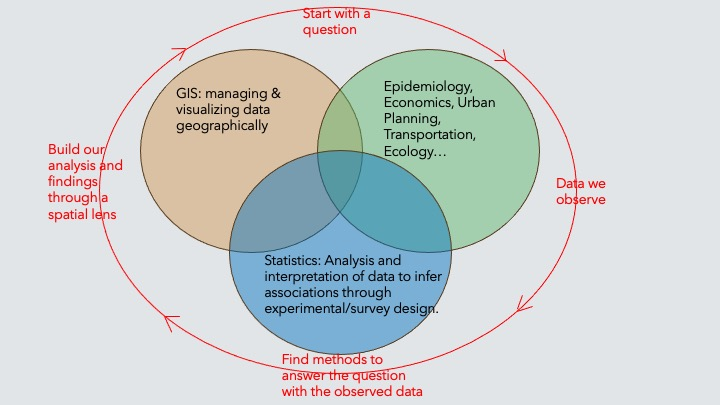
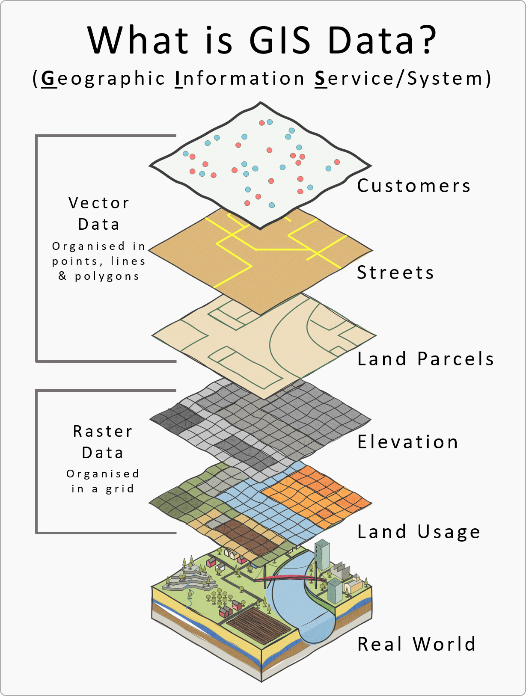
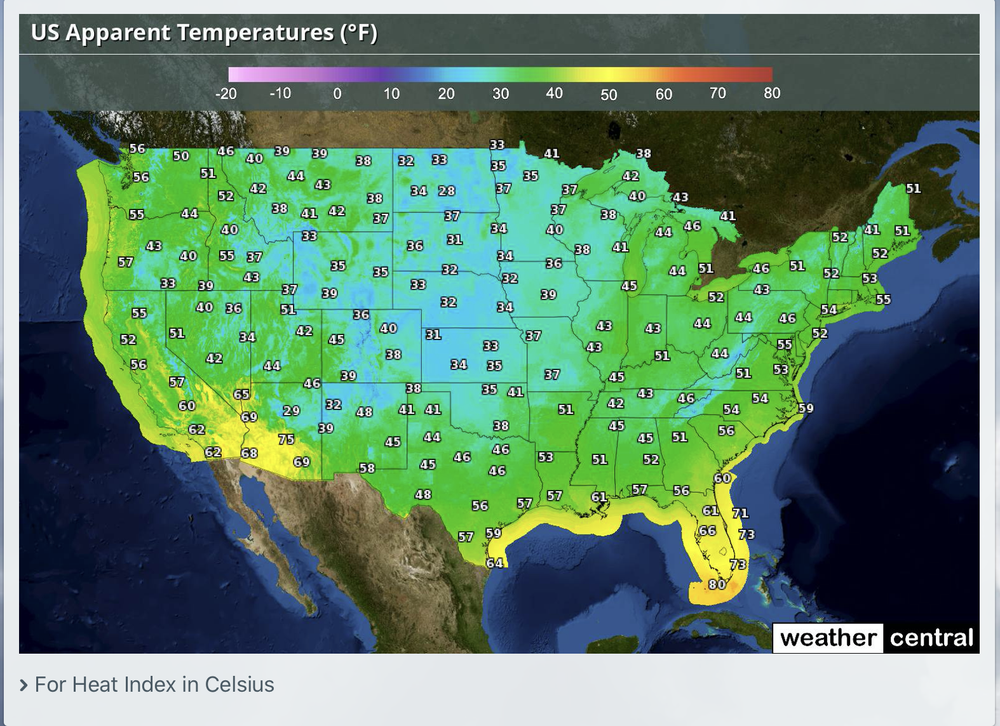
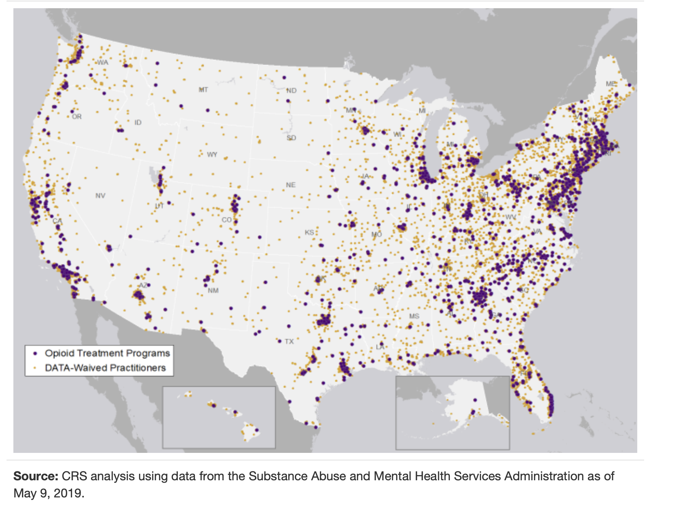
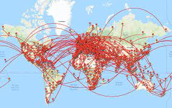
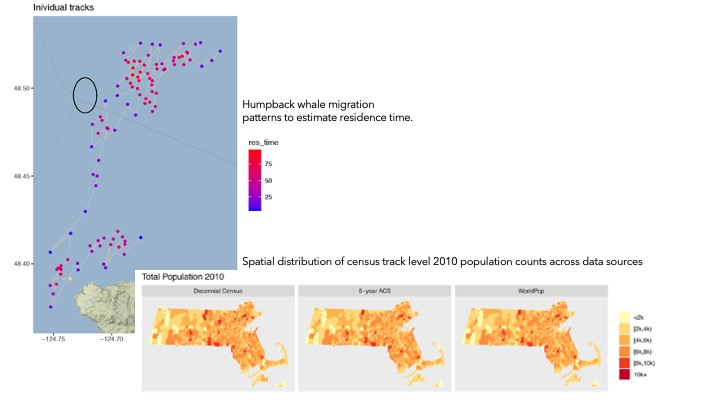
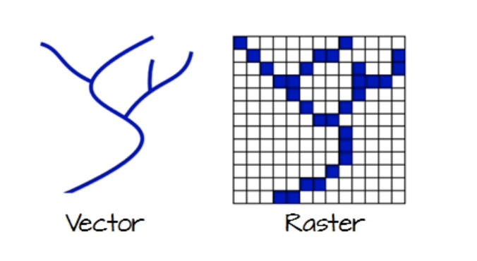
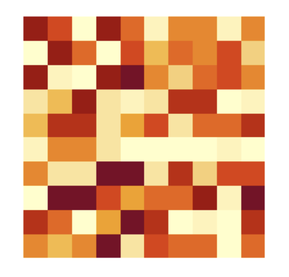

# Introduction to GIS

## What is GIS?

+ A Geographic Information System is a multi-component environment used to create, manage, visualize, and analyze data and its spatial counterpart. 

+ GIS lies at the intersection of spatial analysis (inference) and studies of biological and population patterns (epidemiology, economics, etc.). 

```{r echo = F, fig.align='center', out.width='80%', message = F, warning = F, fig.cap = "Visualization of the intersection  of GIS, spatial analysis, and areas of research"}
knitr::opts_chunk$set(cache = TRUE, message =F, warning =F)
 
```

+ In GIS, we aim to answer questions about the spatial patterns observed in the real world through observed data. How do we do this?
    - Start with a real-world question.
    - Collect data that records observations related to variables of interest.
    - Find the methods used to answer the real-world question.
    - Build our analysis and findings through a spatial lens.


## How is GIS used?
Most data has a geographic context therefore can be linked with location data. Whether its real estate transactions, crime records, health data, they almost always occur in a place that has spatial characteristics. GIS analysis consists of combining layers of multiple data sets to produce a comprehensive picture of the underlying spatial process. Each layer corresponds to a spatial layer of information. For example, we can combine layers of geographic state boundaries, roads, and coordinate (point) locations of cases of infections and hospitals to create a comprehensive map of clusters of infection cases and hospitals across states and their distance to hospitals.

```{r echo = F, fig.align='center', out.width='50%', message = F, warning = F, fig.cap = "GIS data layers"}
knitr::opts_chunk$set(cache = TRUE, message =F, warning =F)
 
```


:::{.rmdtip data-latex="{tip}"}
**Thought box**

Based on research you have done in projects or in class, what projects have you done that could be applied to GIS? And what questions could you answer?
:::


## GIS in Action

GIS analysis consists of manipulating, mapping, and analyzing different resolutions of spatial data types. For example, in Figure 1.3, county level opioid mortality rates are mapped using a chloropleth map that indicates the varying levels of mortality by county using color. Each county (captured within a polygon area) has a specific color representing its respective mortality level. 
```{r echo = F, fig.align='center', out.width='70%', message = F, warning = F, fig.cap = "Map of opioid mortality by county in US"}
knitr::opts_chunk$set(cache = TRUE, message =F, warning =F)
 knitr::include_graphics("fig/plot1.jpg")
```
In contrast, a common example of GIS analysis are continuous spatial weather maps, also referred to as heat maps. These maps show high spatial resolutions in which the map surface is broken down into tiny pixels. 
```{r echo = F, fig.align='center', out.width='70%', message = F, warning = F, fig.cap = "Heat map of Heat index across the US"}
knitr::opts_chunk$set(cache = TRUE, message =F, warning =F)
 
```
In many GIS applications, we not only want to look at area level indicators, but we also want to assess spatial patterns of points. Figure 1.5 shows mapped locations of methadone clinics in the US. We may be interested in comparing spatial clustering of points to health outcomes. 
```{r echo = F, fig.align='center', out.width='70%', message = F, warning = F, fig.cap = "Mapped locations of methadone clinics in the US"}
knitr::opts_chunk$set(cache = TRUE, message =F, warning =F)
 
```
In my own research, I try to look at data through a spatial lens. For example, the point plot below is mapped migration patterns of humpback whales in Washington State. The points are interval measures of satellite locations. How can we use this data to inform our understanding of migration patterns? The second plot is a chloropleth of total population sizes by county across 3 different data sources. Looking at how different data sources report different values can give us a sense of where there is a large difference and for what location.  
```{r echo = F, fig.align='center', out.width='70%', message = F, warning = F, "Mapped flight trajectories from major airports"}
knitr::opts_chunk$set(cache = TRUE, message =F, warning =F)
 
```


```{r echo = F, fig.align='center', out.width='70%', message = F, warning = F}
knitr::opts_chunk$set(cache = TRUE, message =F, warning =F)
 
```


## GIS Feature Representation

To work in a GIS environment, real world observations(objects or events that can be recorded in 2D or 3D space) need to be reduced to spatial entities. These spatial entities can be represented in GIS as a *vector* or a *raster*. Below is representation of a river in both vector and raster formats.


```{r echo = F, fig.align='center', out.width='50%', message = F, warning = F}
knitr::opts_chunk$set(cache = TRUE, message =F, warning =F)
 
```


### Vector

Vector features can be decomposed into three different geometric types: *points*, I *lines*, and *polygons*. 


A **point** is composed of one coordinate pair representing a specific location in a coordinate system. Points are the most basic geometric type having no length or area. Points on a map are represented using *symbols* that have both area and shape (e.g., circle, square etc.)

```{r, echo = F, warning = F, message=F}
library(ggplot2)
x <- c(3,1,2,2,1,3,2)
y <- c(1,2,3,1,2,2,3)

dat <- data.frame(cbind(x,y))

ggplot(dat) +
  geom_point(aes(x,y), col = "black")

```


A **line** is composed of a sequence of two or more coordinate pairs called vertices. A vertex is defined by coordinate pairs, just like a point, but what differentiates a vertex from a point isthe explicitly defined relationship with neighboring vertices. Features like roads and rivers are represented using polylines in GIS. Spatial polyline are defined by euclidean distance from point a to b. Line data can refer to roads, streets, flight trajectories, and anything that consists of a path from a start point to an end point. 

```{r, echo = F,warning = F, message=F}
library(ggplot2)
x <- c(3,1,2,2)
y <- c(1,2,3,2)

dat <- data.frame(cbind(x,y))

ggplot(dat) +
  geom_point(aes(x,y), col = "black") +
  geom_line(aes(x,y), col = "red")

```

A **polygon** is composed of three or more line segments whose starting and ending coordinate pairs are the same. Sometimes you will see the word *lattice* or *area* used in lieu of polygon. Polygons represent both length (i.e., the perimeter of the area) and area. They also embody the idea of an inside and outside, i.e., the area that a polygon encloses is explicitly defined in a GIS environment. 


```{r, echo = F,warning = F, message=F, results  = "hide"}
library(tigris)
library(tmap)
options(tigris_use_cache = TRUE)
st <- states(year = 2020, cb = T)

tm_shape(st) +
  tm_borders(col = "black")

```


### Raster

```{r echo = F, fig.align='center', out.width='50%', message = F, warning = F}
knitr::opts_chunk$set(cache = TRUE, message =F, warning =F)
 
```


A raster data model uses an array of cells or pixels to represent real-world objects. Raster datasets are commonly used for representing  and managing imagery, surface temperatures, digital elevation models, and numerous other entities. 

A raster can be thought of as a special case of an area object where the area is divided into a regular grid of cells. But a regularly spaced array of marked points may be a better analogy since rasters are stored as an array of values where each cell is defined by a single coordinate pair inside of most GIS environments. 

Implicit in a raster data model is a value associated with each cell or pixel. This is in contrast to a vector model that may or may not have a value associated with the geometric feature.


