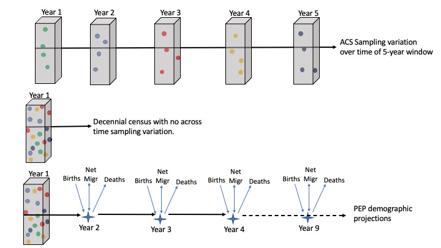

# Data Wrangling {#lecture3}
In this chapter we summarize the various packages and functions that can be used to manipulate and map spatial data in R. 

Note: We reference R documentation to each package below. Click on the package name highlighted in blue to review the CRAN and help documentation for each package. 


## Introduction to DPLYR
The [*dplyr*](https://cran.r-project.org/web/packages/dplyr/dplyr.pdf) package is part of the [*tidyverse*](https://www.tidyverse.org/packages/) (a collection of R packages) and provides a suite of tools for manipulating and summarizing data tables and spatial data. It contains a number of functions for data transformations. DPLYR tools can be in a piping syntax that allows for a sequence of functions to happen at the same time. Think of *dplyr* functions as transformation spells that transform data from one thing to another.


:::{.rmdnote data-latex="{note}"}
Here are a few useful functions:

* *select(c())*: selects the subset of specified columns and reorders them vertically.
* *filter()*: selects a subset of rows in a data frame based on user defined conditional statements.
* *mutate()*: creates and adds new columns based on a given set of operations.
* *recode()*: recodes a current column into a different columns based on a set of operations.
* *arrange()*: changes order of rows according to the columns specified.
* *desc()*: orders a column in descending order.
* *summarize()*: summarizes values with function that are passed, i.e., mean, max.
* *group\_by()*: groups values for a given category.
* *full\_join, right\_join, left\_join*: Merges data set based on either joining all or a subset of observations.
:::

The *dplyr* functions take a data frame as the first argument and layers functions using what we refer to as piping operator $%>%$. It condenses many lines of code into a single chunk. To illustrate *dplyr* tools, we use the flights data set that is available from *dplyr*.

First we must install the R packages if they have not be already installed.
```{r, echo = FALSE, message = FALSE, error = F, eval = F, comment= NA}
# Run install packages code if not already done.
 install.packages(c("tidyverse", "dplyr", "tidyr"), repos = "http://cran.us.r-project.org")
```
Next we call the *tidyverse* and *dplyr* packages
```{r, message = FALSE, error = F, warning = F, comment = NA}
# Call libraries
library(tidyverse)
library(dplyr)
library(tidyr)

# To explore more of dplyr documentation and examples use code below.
#vignette("dplyr", package = "dplyr")
```

Next we read in the Air Passengers data using the $data()$ call function. This data records monthly totals of the number of international airline passengers from 1949-1960. Using the *class()* function, you can see what type of R object. This R object is a time-series (ts) and needs to be converted to a data frame.
```{r, warning =F, message = F,  comment = NA}
#Read in the starwars data
data("AirPassengers")
#Determine the type of R object
class(AirPassengers)
```

We transform the time series into a data frame with the below commands. The rows are the different years and the columns are months Jan-Dec.
```{r, warning =F, message = F,  comment = NA}
#Transform the time series data into a data frame
air_passengers_df <- matrix(AirPassengers, ncol = 12, nrow = 12, byrow = T)
rownames(air_passengers_df) <- 1949:1960
colnames(air_passengers_df) <- c("Jan", "Feb", "Mar", "Apr", "May",
                                 "Jun", "Jul", "Aug", "Sep", "Oct",
                                 "Nov", "Dev")

air_passengers_df <- data.frame(air_passengers_df)
head(air_passengers_df)
```


:::{.rmdnote data-latex="{note}"}
**What is piping?**
A piping syntax allows us to manipulate/mutate the data using a sequence of transformations, i.e., operations are chained together. The pipeline operator is denoted using %>%.
:::

For example, in many cases we need to switch from wide data to long data or vice-versa. In this case, we want a monthly count as a unique row, so we want to transform this data from wide (going across columns) to long (going down rows).

*Sequence of operations*:


  - Create a year variable in the data because we want each row to be a unique month-year combination. The $rownames()$ function extracts the names of each row (i.e., the year corresponding to the row). The $as.numeric()$ function turns characters into numbers.


```{r, warning =F, message = F,  comment = NA}
air_passengers_df$year <- as.numeric(rownames(air_passengers_df))
```
   - Create a new data set called *air_passengers_long* and assign <- it to the old data set.
  - Use the *gather()* function from the *tidyr* package to convert the data to long.
```{r, warning =F, message = F,  comment = NA}
air_passengers_long <- air_passengers_df %>%
  gather(key= "Month", value = "count", -year)

head(air_passengers_long)
```
If we want to filter the data to only include the month of January, we use the first line of code. If we want to filter to Jan and the year is greater than 1955, we can use the second line of code.
```{r, warning =F, message = F,  comment = NA}
#Use the filter function to subset only to data for Jan.
jan_only_df <- air_passengers_long %>%
  filter(Month == "Jan")

#Use the filter function to subset only to data for Jan AND for years > 1955
jan1955_only_df <- air_passengers_long %>%
  filter(Month == "Jan" & year > 155)
```
We can arrange the dataset in order of a variable using the *arrange()* function.

```{r, warning =F, message = F,  comment = NA}
#Arrange the data by year
arrange_df <- air_passengers_long %>%
  arrange(year)
head(arrange_df)
```

Two important functions are the *mutate()*  and *summarize()* functions. We create new variables (not already defined) using the mutate function. For example, if we want to create a new logical variable that is TRUE if year > 1955, we can use the code below.

```{r, warning =F, message = F,  comment = NA}
#Create a new logical variable using the mutate function, if year > 1955 then TRUE else FALSE.
mutate_df <- air_passengers_df %>%
  mutate(year_indicator <- ifelse(year > 1955, TRUE, FALSE))
```

If we want to summarize the data, we can use the *summarize()* function. For example, if we want the mean number of passengers by year, we first use the *group_by()* function to define which groups we want to summarize, in this case it is year. Then we use the *summarize()* function to define what summaries we want, e.g., mean, sd, median, and others.

```{r, warning =F, message = F,  comment = NA}
# First group_by year to group the data by year variable.
#Then summarize the mean number of passengers to get the mean BY year.
summary_df <- air_passengers_long %>%
  group_by(year) %>%
  summarize(mean_number = mean(count))

head(summary_df)
```

Putting all this together using a piping syntax

```{r, warning =F, message = F,  comment = NA}
library(dplyr)
data("AirPassengers")
air_passengers_df <- matrix(AirPassengers, ncol = 12, nrow = 12, byrow = T)
rownames(air_passengers_df) <- 1949:1960
colnames(air_passengers_df) <- c("Jan", "Feb", "Mar", "Apr", "May",
                                 "Jun", "Jul", "Aug", "Sep", "Oct",
                                 "Nov", "Dev")

air_passengers_mean_data <- data.frame(matrix(AirPassengers, ncol = 12, nrow = 12, byrow = T)) %>%
  dplyr::rename(c("Jan" = "X1", "Feb" = "X2", "Mar" = "X3", "Apr" = "X4", "May" = "X5",
                                 "Jun" = "X6", "Jul" = "X7", "Aug" = "X8",
                                  "Sep" = "X9", "Oct" = "X10",
                                 "Nov" = "X11", "Dec" = "X12")) %>%
  dplyr::mutate(year= c(1949:1960),
                year_indicator <- ifelse(year > 1955, TRUE, FALSE)) %>%
   tidyr::gather(key= "Month", value = "count", -year) %>%
    dplyr::filter(Month == "Jan") %>%
      dplyr::arrange(year) %>%
        dplyr::group_by(year) %>%
           dplyr::summarize(mean_number = mean(count))

air_passengers_mean_data
```


## Introduction to *sf*

A new class of spatial objects has been defined called simple features [*sf*](https://cran.r-project.org/web/packages/sf/vignettes/sf1.html). $Sf$ objects appear as a data frame with an extra column named **geometry** that contains the geometrical information for the spatial part of the object. For the rest of the chapter, we will learn how to manipulate spatial features. 

```{r echo = F, fig.align='center', out.width='50%', message = F, warning = F}
knitr::opts_chunk$set(cache = TRUE, message =F, warning =F)
knitr::include_graphics("fig/sf.jpg")

# knitr::include_url("https://r-spatial.github.io/sf/")
```
Illustration by Allison Horst, see [Simple Features Blog]("https://r-spatial.github.io/sf/")

:::{.rmdnote data-latex="{note}"}
**What is a feature?**

A feature is thought of as a thing, or an object in the real world, such as a building or a tree. Features have geometry describing where on Earth the feature is located, and they have attributes, which describe other properties.
:::

**Simple feature geometry types**

The following seven simple feature types are most common.

\begin{tabular}{|c|c|}
Type & Description\\
Point & zero-dimensional geometry containing single point\\
\end{tabular}

```{r echo = F, fig.align='center', out.width='50%', message = F, warning = F}
knitr::opts_chunk$set(cache = TRUE, message =F, warning =F)

d <- cbind("Type" = c("POINT", "LINESTRING", "POLYGON", "MULTIPOINT", "MULTILINESTRING", "MULTIPOLYGON"), "Description" = c("zero-dimensional geometry containing single point", "sequence of points connected by straight, non-self intersecting line pieces; one-dimensional geometry", "geometry with a positive area (two-dimensional); sequence of points form a closed, non-self intersecting ring; the first ring denotes the exterior ring, zero or more subsequent rings denote holes in this exterior ring", "set of points; a MULTIPOINT is simple if no two Points in the MULTIPOINT are equal", "set of linestrings", "set of polygons"))
knitr::kable(d)

# knitr::include_url("https://r-spatial.github.io/sf/")
```

We are going to use data from New Haven CT to work with different kinds of spatial data. First we need to run the commands below to us the $sf$ package and the New Haven data. The New Haven data contains several $sf$ data frames:
    1. *blocks* is a data frame with population demographics broken down by block. These attributes are saved within spatial polygons (boundaries of the blocks).
    2. *breach* is a data frame with location data for public disturbances (crimes). These attributes are saved with spatial points (x,y coordinates of the breaches).
    3. *roads* contains spatial lines that mark road locations.

```{r, message=F, comment = NA }
#Install and Call in the sf and GISTools libraries.
library(sf)
library(dplyr)
library(GISTools)

#Call in the newhaven data
data(newhaven)
```

Below shows the *blocks* sf data frame which gives an example of how a *sf* data frame contains both spatial locations/features and the attributes of those features. Below the geometry type is listed as a polygon which captures the boundaries of the census blocks. It also shows the bounding box of the minimum and maximum x,y coordinates. Each column denotes the spatial attributes or characteristics for each block (row), e.g., The POP1990 column reports the total population in 1990 for block 1 (pop=3071). The last column *geometry* holds the spatial features of each block meaning the geographic boundaries of the polygon.
```{r, echo = F, comment = NA}
blocks_sf <- st_as_sf(blocks)
breach_sf <- st_as_sf(breach)
head(blocks_sf)
```

Many of the *dplyr* functions described above can be used on an *sf* data frame. For example, we can use the $filter()$ function to only include larger populations with POP1990> 1000. Additionally, we can create a new variable called *RentOcc* that calculates the number of housing units that are renter occupied.

```{r, comment = NA}
#Use the filter function to subset to blocks with population >1000
# Use mutate function to create RentOcc = number of renter occ housing units.
blocks_subset <- blocks_sf %>%
  filter(POP1990>1000) %>%
  mutate(RentOcc = HSE_UNITS * P_RENTROCC/100)
```


**Spatial Joins** combine multiple data sets in the case where any of the data are recorded as spatial features. To join a $sf$ data set, use the $st_join(x,y)$ function. The data in data set $y$ are merged in with the data in $x$. If $y$ contains values outside of $x$ boundaries, these are discarded. For example, if there is a location in $y$ outside of boundaries in $x$ it will be removed.

In the below code, we merge together the data from the *block_sf* data set (population attributes of the census blocks) and the *breach_sf* data set (locations of crimes). The new data set called *block_breach_sf* is a polygon object, with attributes of the polygon containing each particular point being joined as columns.

```{r, comment = NA}
temp <- breach_sf %>%
  st_join(blocks_sf)

```


## An Introduction to TMAP


This section will concentrate on learning the functions in the [*tmap*](https://cran.r-project.org/web/packages/tmap/vignettes/tmap-getstarted.html) (Tennekes, 2015). This package focuses on mapping the spatial distribution of data attributes. It has a similar grammar to plotting with the ***ggplot** package in that it seeks to handle each element of the map separately in a series of layers.

The process of making maps using *tmap* is one in which a series of layers are added to the map. First $tm_shape()$ is specified, followed by an aesthetic function that specifies what is to be plotted. The input to $tm_shape()$ is an sf object.


### Layer 1
For example, we may want to plot the New Haven crime data. The first layer of the plot is the geographic polygons (census block boundaries) of New Haven. We input the $blocks\_sf$ object in the $tm_shape()$ function. We plot the borders spatial layer of the data which outlines census block boundaries. To add custom styles to the background, refer to $?tm\_style$ and $tm\_layout$ to see possible options in the documentation.

```{r, warning = F, message = F, comment = NA}

?tm_style
?tm_layout

tm_shape(blocks_sf)+
  tm_borders(col = "red", lty = "dashed") +
  tm_style("natural", bg.color = "lightblue") +
  tm_layout(title = "New Haven CT",
            title.size = 1,
            title.position = c(0.55, "top"))

```

So what you can see in the above code is one set of layers for the borders where we customize the look, color, and outline.

### Layer 2

A plot of geographic boundaries alone does not give much information. We add a second layer where we can include the spatial attributes of the areas (polygons). To add the second layer to the current plot, add another $tm\_shape()$ function, and add the second $sf$ object input that contains the spatial area data. For example, here we will plot the percent of renter occupied housing units.


```{r, warning = F, message = F, comment = NA}

?tm_style
?tm_layout

tm_shape(blocks_sf)+
  tm_borders(col = "red", lty = "dashed") +
  tm_shape(blocks_sf) +
  tm_polygons(col = "P_RENTROCC", palette = "Blues") +
  tm_layout(title = "New Haven CT",
            title.size = 1,
            title.position = c(0.55, "top"))

```

### Layer 3
The third layer of the New Haven plot may include the point layer which plots the geographic coordinates of the breaches of the peace.  We add point data using the $tm\_dots()$ command.


```{r, warning = F, message = F, comment = NA}

?tm_style
?tm_layout

tm_shape(blocks_sf)+
  tm_borders(col = "red", lty = "dashed") +
  tm_polygons(col = "P_RENTROCC", palette = "Blues") +
    tm_shape(breach_sf) +
      tm_dots(col = "blue", size = 0.1) +
  tm_layout(title = "New Haven CT",
            title.size = 1,
            title.position = c(0.55, "top"))

```

### Layer 4
The fourth layer of the New Haven plot may include the lines layer which plots the roads in New Haven. Again, add another $tm\_shape()$ function, and add the third $sf$ object input that contains the lines data (**roads_sf**). We add line data using the $tm\_lines()$ command.


```{r, warning = F, message = F, comment = NA}

?tm_style
?tm_layout
roads_sf <- st_as_sf(roads)
st_crs(roads_sf) <- st_crs(blocks_sf)

tm_shape(blocks_sf)+
  tm_borders(col = "red", lty = "dashed") +
  tm_polygons(col = "P_RENTROCC", palette = "Blues", alpha = 0.5) +
    tm_shape(breach_sf) +
      tm_dots(col = "blue", size = 0.1) +
        tm_shape(roads_sf) +
          tm_lines(col = "purple", alpha = 0.5) +
  tm_layout(title = "New Haven CT",
            title.size = 1,
            title.position = c(0.55, "top"))

```


### Adding Context

In some situations a map with background context may be more informative. There are a number of options for doing this, including *OpenStreetMap*, *GoogleMaps*, and *Leaflet*. This requires some additional packages to be downloaded and installed in R.

```{r, warning=F, message = F, eval = F, comment = NA}
install.packages("OpenStreetMap", dep=T)
library(OpenStreetMap)
```

Using [*OpenStreetMap*](https://cran.r-project.org/web/packages/OpenStreetMap/OpenStreetMap.pdf), the approach is to define the area of interest, to download and plot the map tile from OpenStreetMap and then to plot your data over the tiles.

```{r, warning=F, message = F, comment = NA}
library(OpenStreetMap)
library(tmaptools)


tmap_mode("plot")

#To use Open Street Map, transform first to projections to EPSG 4326.
"+proj=longlat + ellps=WGS84"
blocks_transform <- st_transform(blocks_sf, 4326)
breach_transform <- st_transform(breach_sf, 4326)

box <- st_bbox(blocks_transform)

test <- read_osm(box, type = "osm")

om_map <- tm_shape(test) +
  tm_rgb() +
  tm_shape(breach_transform) +
  tm_dots(col = "red")

print(om_map)

```


### Saving Your Map

Having created a map in a window, you may now want to save the map for either printing or incorporating into a document. There are a few simple steps to save a map in multiple formats.

1. If you plot the map in the **Viewer** pane (bottom right), you can click on the **Export** button to save as a pdf or copy to clipboard.

2. To directly save a map as a pdf/png or jep. Above the open street map object was assigned to "om_map". Taking a pdf export for example, print the map after using the $pdf()$ command, which lists the filepath and the pdf file name and extension.

```{r, eval = F, warning = F, message = F, comment = NA}
pdf("filepath/mymap.pdf")
print(om_map)
dev.off()


jpeg("filepath/mymap.jpg")
print(om_map)
dev.off()
```


### Interactive Mapping

Interactive maps are a great method to include multiple pieces of information within one map. Changing the tmap mode to "View" allows for an interactive map to be created using Leaflet in $tmap$. To have multiple pieces of information contained within the map, the $mapview$ package

```{r, warning=F, message = F, comment  = NA}
# tmap_mode("view")
# 
#    tm_shape(test) +
#    tm_rgb() +
#    tm_shape(breach_transform) +
#    tm_dots(col = "red")
```


## Introduction to TIDYCENSUS

The [tidycensus](https://cloud.r-project.org/web/packages/tidycensus/tidycensus.pdf) package by Kyle Walker is an R package designed to facilitate the process of acquiring and working with US Census Bureau population data in the R environment. It is designed to streamline the data wrangling process for spatial Census data analysis. With *tidycensus* R users can acquire census reported variables of interest AND geometric and spatial attributes which helps facilitate mapping and spatial analysis. US Census Bureau data consists of:


```{r echo = F, fig.align='center', out.width='70%', message = F, warning = F}
knitr::opts_chunk$set(cache = TRUE, message =F, warning =F)

```


  1. US decennial census data from 2010 and 2020 requested using $get\_decennial()$.
  2. 1-year and 5-year American Community Survey (ACS) population and demographic data requested using $get\_acs()$.
  3. Population Projection Estimates (PEP) requested using $get\_estimates()$.
  4. ACS Public Use Microdata requested using $get\_pums()$.
  5. ACS Migration Flows requested using $get\_flows()$.

Note this is not a comprehensive tutorial on *tidycensus*. It will give you an introduction to the capabilities of the package.

### Geography in Tidycensus

The USCB reports data from the national level to county to census block level. Importantly, not all data sources report data at all geographies. The decennial census and 5-year ACS estimates report down to census block. However, PEP only reports down to county level and metro/micro-politan areas.


### Searching for variables in Tidycensus

One challenge is extracting variable names from the USCB data sources. The *tidycensus* package contains a $load\_variable()$ function that can list variable names and their descriptions. By browsing or subsetting the table, you can search for the relevant variables needed for your analysis.

```{r, warning=F, message = F, comment = NA, results = "hide"}
# install.packages("tidycensus")
library(tidycensus)
vars <- load_variables(2020, "acs5")
head(vars)
```

### Extracting the data in Tidycensus

Let's work through examples on how to extract ACS. The parameters passed through the $get\_acs()$ function require the:
  1. **geography** which the the spatial resolution you want reported. Here we want county level data.
  2. **state** is an optional parameter if you want a specific state. The default is NULL if you want the US.
  3. **variables** listed the needed variables from the list above. Here we chose the variable for median household income.
  4. **year** (self-explanatory?)
  5. **geometry** is an important parameter. When set to $T$ the data frame will include the spatial boundaries of the counties in your data frame and will produce an $sf$ object.

```{r,  message = F, comment = NA, warning=F, results = "hide"}

library(tidycensus)
library(tidyverse)

ga_hinc <- get_acs(
  geography = "county",
  state = "Georgia",
  variables= c("B19013_001"),
  year = 2020,
  geometry = T)

head(ga_hinc)

```


The resulting data frame a row for each county. Each row lists the county name, the estimate of the variable, and the associated margins of error (otherwise referred to as sampling error from ACS). Additionally, we have a geographic identification (GEOID) and the geometric features column.


Next let's work through examples on how to extract PEP. The parameters passed through the $get\_estimate()$ function require the:
  1. **geography** which the the spatial resolution you want reported. Here we want county level data.
  2. **state** is an optional parameter if you want a specific state. The default is NULL if you want the US.
  3. **product** lists three optioins: (1) population totals ("population"), (2) populations by characteristics ("characteristics"), and (3) housing units ("housing"). Here we request populations by sex and race breakdowns.
  4. **breakdown* lists RACE, SEX, AGE (for years 2020+), and HISPANIC.
  4. **year** (self-explanatory?)
  5. **geometry** again set to $T$ the data frame will include the spatial boundaries of the counties in your data frame and will produce an $sf$ object.


```{r, warning = F, message = F, comment = NA, results = "hide"}

library(tidycensus)
library(tidyverse)
library(tmap)

ga_sexrace <- get_estimates(
  geography = "county",
  state = "Georgia",
  product= c("characteristics"),
  breakdown = c("SEX","RACE"),
  breakdown_labels = T,
  year = 2019,
  geometry = T)

head(ga_sexrace)

```


The resulting data frame a row for each county. Each row lists the county name, the value of the variable. For example, the population estimate for 2019 for the White population in Fulton County is 483838 across both sexes.

## Introduction to Shapefile and Tigris

Shapefiles are a popular method of representing geospatial vector data in GIS. The shapefile can store data in the form of points, lines, or polygons. They can be used to represent administrative boundaries (think country/state/county borders) or roads, rivers, lakes etc. These shapes, together with data attributes that are linked to each shape, create the representation of the geographic data. Three mandatory files related to shapefiles use the extensions (.shp, .shx, .dbf). The actual shapefile relates to the.shp file. 


Shapefiles can be found on the internet with various publishers. For example,the US census bureau publishes shapefiles for the entire US. The USCB's TIGER/Line database includes high-quality series of geographic datasets suitable for spatial and cartographic analyses. The TIGER/Line shapefiles include three general types of data:

1. Legal entities: Legal geographic entities including county and state boundaries. 
2. Statistical entities: Non legal entities but boundaries with statistical meaning, i.e., census tracts and. block groups. 
3. Geographic features: Geographic datasets linked with aggregrate demographic information including water and road fetures.

From the USCB website, we downloaded the shapefile that contains all roads for the state of GA. Using the $sf$ package, we read in the shapefile using the $st\_read$ function. This gives an $sf$ data frame that contains the geometric features from the shapefile. Using the $tmap$ package, we can plot the $sf$ object.


```{r, warning = F, error = F, results = "hide"}
shp <- st_read("data/shapefiles/tl_2019_13_prisecroads.shp")
class(shp)
head(shp)

tm_shape(shp) +
  tm_lines(col = "black")

```


The [tigris](https://cran.r-project.org/web/packages/tigris/tigris.pdf) package simplifies the process for R users of obtaining and using Census geographic datasets. The full list of shapefiles in *tigris* are available [here](https://github.com/walkerke/tigris)


For example, the $states()$ function can be used to download the boundaries of U.S. states. This function produces an $sf$ data frame with geometric features. 
```{r, comment = NA, message = F, warning = F, results = "hide"}
# install.pakcages("tigris", dep =T)
library(tigris)
library(tmap)
st <- states()
head(st)
tm_shape(st$geometry) +
  tm_borders(col = "black")
```

Additionally, we can extract shapefiles corresponding to specific counties within a state.
```{r, comment = NA, message = F, warning = F, results = "hide"}
ga_counties <- counties("GA")
tm_shape(ga_counties) +
  tm_borders(col = "black")
```

Let's add to this map by adding roads and water areas. We get the roads for GA using the $primary\_secondary\_roads()$ function that requires the state parameter to be set. To obtain the water areas, we must obtain water geometries for each county within the state of GA. We use the $area\_water()$ function that has state and county parameters.

```{r, comment = NA, message = F, warning = F, results = "hide"}

fips <- unique(ga_counties$COUNTYFP)


road_data <- primary_secondary_roads("GA")
water_list <- list()

for(c in 1:length(cos)){
water_list[[c]] <- area_water("GA", fips[c])
}

water_data <- do.call("rbind", water_list)

tm_shape(ga_counties) +
  tm_borders(col = "black") +
  tm_shape(water_data) + 
  tm_borders(col = "blue") +
  tm_shape(road_data) +
  tm_lines(col = "orange")

```


:::{.rmdtip data-latex="{tip}"}
**Lab 3 Activity**


<!-- 1. For you class project, write up an introductory paragraph that describes the public health issue you are addressing. Describe any background information on prevalence or incidence of the public health indicator and why it is an important issue (i.e., the negative impact on population health). Reference any citations you review in your paragraph.  -->

1. For this lab, you will be reading in your project data which will contain different data tables dependent on your particular project. Read in your data and explore the data using the $View()$ and $head()$ functions. 


2. For US-based projects, use *tidycensus* to extract population counts for your given area using the $get\_estimates()$ function that provides PEP based population counts.  Be sure to include the geography to have area level data. For non-US based projects, use the $st\_read()$ function to read in necessary shapefiles. 

3. Write an introduction *Data* paragraph that describes the above to an audience not familiar with your project. Describe the data reported in each data table. This will include the following:
    a. The "relevant" variables contained in the data table. 
    b. The geographical units captured in the data. 
    c. The type of data (points, lines, polygons)

4. Do a spatial join with points and polygon data using the $st\_join()$ function from $sf$. Create a new data set that contains the area attributes corresponding to each geographic point. 

5. Use layering in $tmap$ to produce a preliminary plot of both a chloropleth map of area attributes with points representing location data. 

6. Write a descriptive paragraph *Exploratory Analysis* that illustrates the map and the various patterns from the observed data. Based on this map, add descriptions of spatial relationships you observe. 
:::

