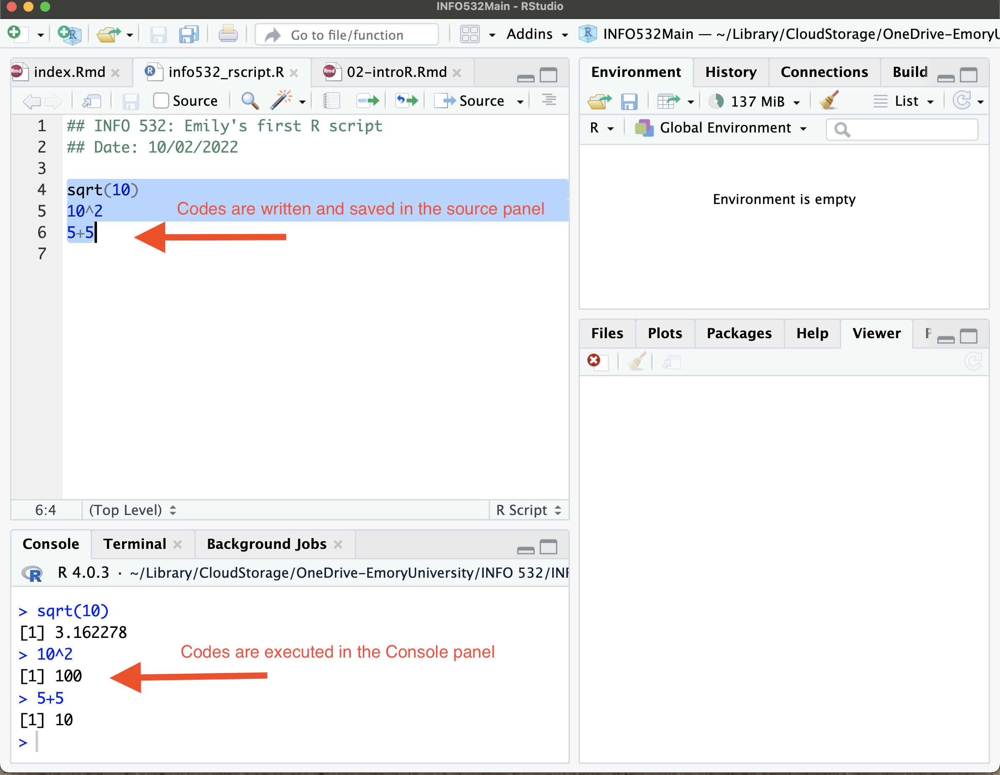
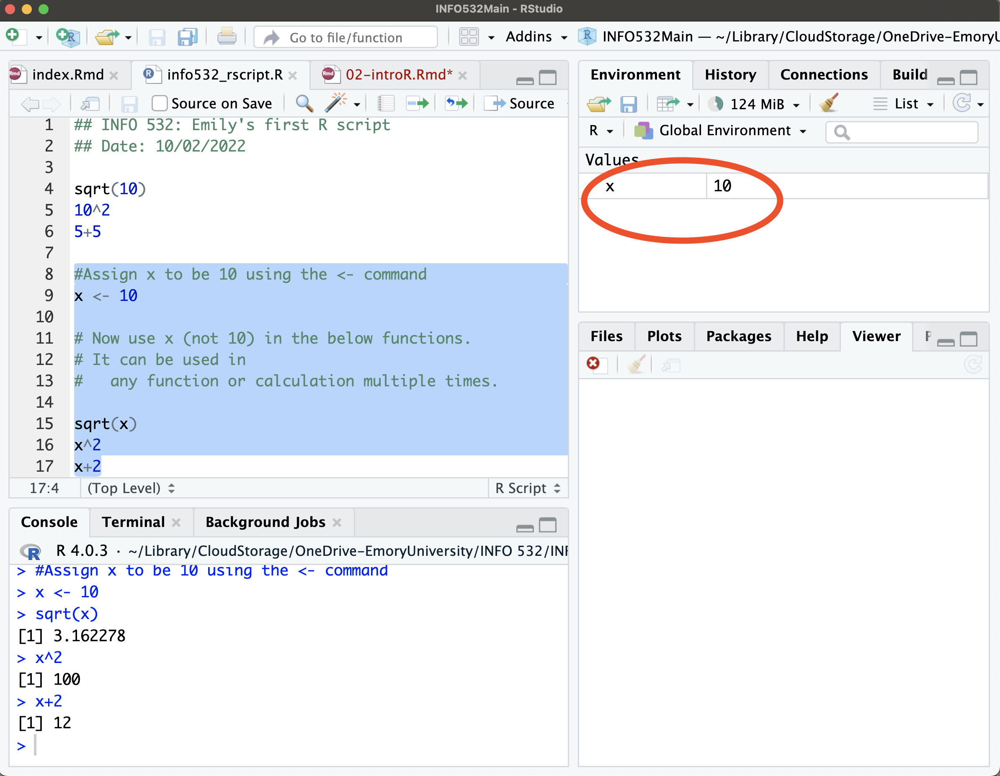
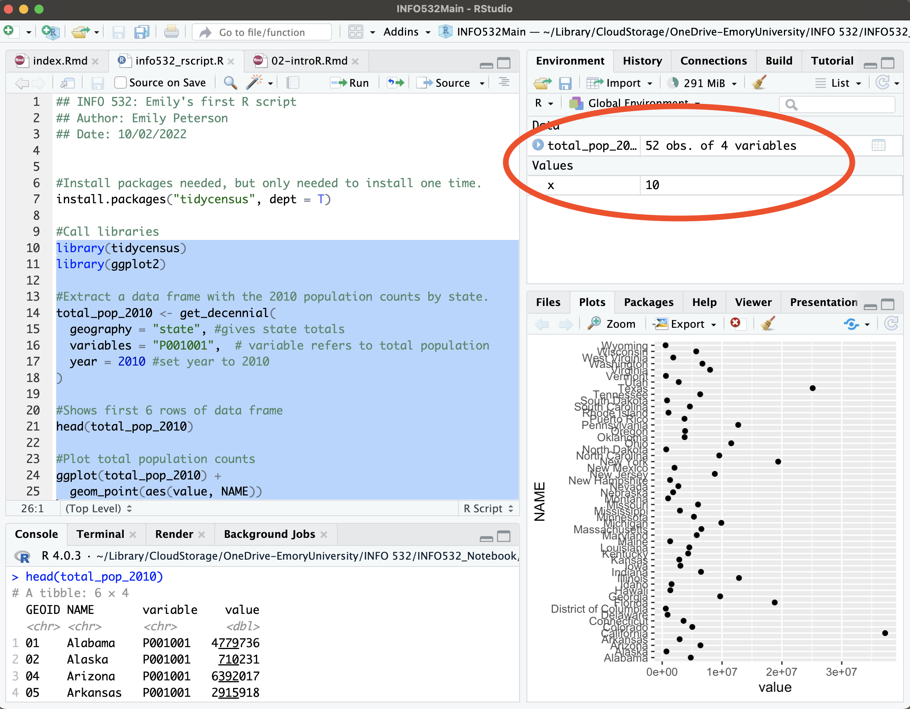
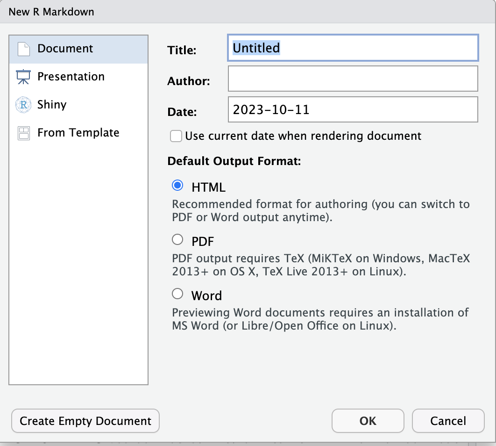
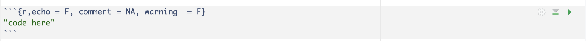

# Introduction to R {#intro}
This section describes the basic ways of assigning values to different types of R objects and different classes of R objects. R and RStudio must be installed on your system! Refer to Lab 0 for installation directions. 

## Panes in RStudio
+ The Source Editor can help you open, edit, execute and save these programs. It is the panel on the top left of your screen. 

+ The console is where you can type code that is executed immediately. This is also known as the command line. It is at the bottom left of your screen. 

+ The Environment pane is very useful as it shows you what objects (i.e. arrays, data, functions) you have in your workspace. 

+ The last pane has a number of different tabs:

    - The Files tab has a navigable file manager.
    - The Packages tab shows you the packages installed.
    - The Plot tab is where graphics are shown.
    - The Help tab allows you to search R documentation for help.


## Your first R script 


:::{.rmdnote data-latex="{note}"}
**What is an Rscript?**
An Rscript is simply a text file containing (almost) the same commands that you would enter on the command line of R.
:::


+ Open RStudio.
+ Go to **File**.
+ Select **New File**
+ Select **R Script**.
+ Save/Name the R script in a working directory.


Below is an example of an Rscript that was saved as info-532\_rscript.R. In the RStudio session, you see the created **Rscript** on the left-top pane. In this pane you will write all your R code to be saved within the Rscript. The bottom-left pane **Console** shows completed functions or tasks. The right panes shows the Global Environment and the Viewer panes (coming back to this later).  
    



In order to execute commands from your Rscript, select the line of code you want to run and press (CMD-Enter on a Mac). There is also a Run button on the top right of your Script panel. You can select the lines of code, and use either of these ways to get your commands to run. Once completed, it will show up in the console panel.

The > in the console panel indicates that code is ready to be run. The figure below shows a few lines of code that has been written in the Rscript (top left pane), and then has been executed. You can see in the console pane (bottom left) the code has been executed and the results are shown below each line of code. 


**Assiging values to objects**

In an Rscript, we often want to define or assign an object in order to use it in later functions. We can do this using the <- symbol. Using the above example, the number of 10 was used in 2 lines of code, i.e., $sqrt(10)$ and $10^2$. Instead, it is more efficient to assign an object to be 10 so it can be used multiple times. In the code below, we assign $x$ to have a value of 10 by typing $x$ <- 10 in our Rscript, and then use $x$ in the following commands. You can see the results in the console pane, where it knows that $x=10$ and so runs the calculations on $x$ to produce the shown results.



Notice that something has been added to your **Global Environment** pane on the top-right. What does this mean? When anything is assigned in your Rscript (using <-), it needs to be saved somewhere so it can be used multiple times. It is saved in a space called the **Global Environment**. Anything you assign or create is shown in the **Global Environment** pane. The top-right pane shows that an object named $x$ was assigned a value of 10.


## Data Types in R

The first bit of coding above was to get you used to the R environment. Now we are going to explore the different data types in R. There are a few fundamental data types in R the provide the building blocks for any data analysis. This section will explore some of these data types and illustrate how to perform operations on them.

### Vectors

A vector is a group of values of the same type. What this means is that all the values are either numerical (numbers), characters (letters), or logical (True or False). A vector is created in the Rscript using the combine function, written as the $c()$ command. Using the code below we create a vector of numbers (2,...,8). We assign (<-) this vector the name $x$. We also create a vector of numbers called $y$. Let's say we want to combine $x$ and $y$ to create one long vector called the $z$. We can simply *combine* them using the $c()$ command.


```r
#Create numeric vector x
x <- c(2,3,5,7,8)
#Create numeric vector y
y <- c(1,1,2,3,4)
#Combine x and y to make z
z <- c(x,y)

#Look at z
z
```

```
 [1] 2 3 5 7 8 1 1 2 3 4
```

Vectors are not just groups of numbers, but also can be groups of characters or True/False values. Below a vector of cities has been created called *cities* and a vector of fruits has been created called *fruits*. Note that when typing characters in an Rscript, the words/characters must be enclosed with quotations marks to indicate it is a character value. When there is a missing value in a vector it is denoted with *NA* shown below.


A logical vector is a group of elements that are either TRUE or FALSE. For example, looking at the cities vector, you can create a logical vector that indicates if each city is in the Northern US as shown below. Again here *NA* indicates a missing value.

A factor vector consists of specified categories. For example the factor vector created below called *blood.pressure* has 8 elements, but three main categories of (1) Low, (2) Medium, and (3) High. So we use the *factor()* command to take the character values and order them based on the assigned levels. When we look at the blood.pressure vector we see the 8 elements first [1], and also how the different levels are defined.


```r
# Character vectors
cities <- c("New York City", "Atlanta", "Seattle", "Dallas", NA)
fruits <- c("apples", "kiwis", "watermelon", "bananas")

#Logical vectors (are the cities norther?)
northern <- c(TRUE, FALSE, TRUE, FALSE,NA)

#Factor vector
blood.pressure <- factor(c("High", "Medium", "High", "Low", "Medium", "Low", "High", "High"),
                         levels = c("Low", "Medium", "High"))
blood.pressure
```

```
[1] High   Medium High   Low    Medium Low    High   High  
Levels: Low Medium High
```

### Matrices and Data Frames

Matrices and data frame are like data tables with a row and column structure. The main difference between a matrix and data frame is that in a matrix it can only contain a single data type (e.g., numeric, logical, character), and a data frame can contain multiple types in each column. In both cases matrices and data frames are simply multiple vectors combined together.

To define a matrix, use the command matrix as shown below. We create a matrix of the sequence of numbers 1 to 10. Note how the sequence of numbers is ordered with the *byrow* parameter. If *byrow* is set to FALSE, it is ordered by column.  The matrix has 2 columns and 5 rows, which was defined by *ncol = 2*. We can change the number of columns to be 5 with 2 rows. Positions of matrix elements (called subscripts) are indicated by a row and column number, which is shown within square brackets [row,col].The row number is indicated vertically on the left. (e.g., rows 1 & 2 are [1,], [2,]). And the column number is indicated horizontally above the first row (e.g., columns 1 & 2 are [,1], [,2]). If you want to see the element at a given position (subscript), write out the name of the matrix and the position number shown below. In this example we examine the matrix at positions [1,1] and [5,2]. In position [1,1], the value is 1, and in position [2,5] the value is 10. If you input a position that doesn't exist, it will give an error message stating the subscript are out of bounds.


```r
matrix_byrow <- matrix(1:10, ncol =2, byrow=T)
matrix_byrow
```

```
     [,1] [,2]
[1,]    1    2
[2,]    3    4
[3,]    5    6
[4,]    7    8
[5,]    9   10
```

```r
matrix_bycol <- matrix(1:10, ncol = 2, byrow = F)
matrix_bycol
```

```
     [,1] [,2]
[1,]    1    6
[2,]    2    7
[3,]    3    8
[4,]    4    9
[5,]    5   10
```

```r
matrix_col <- matrix(1:10, ncol =5, byrow = T)
matrix_col
```

```
     [,1] [,2] [,3] [,4] [,5]
[1,]    1    2    3    4    5
[2,]    6    7    8    9   10
```

```r
matrix_col[1,1]
```

```
[1] 1
```

```r
matrix_col[2,5]
```

```
[1] 10
```

```r
matrix_col[5,2]
```

```
Error in matrix_col[5, 2]: subscript out of bounds
```

Matrices can contain any data type, but it must be the same data type. For example, a matrix of characters is defined below.


```r
x <- c("apples", "bananas","pears", "apples", "pears", "kiwis")
matrix_fruits <- matrix(x, ncol =2)
matrix_fruits
```

```
     [,1]      [,2]    
[1,] "apples"  "apples"
[2,] "bananas" "pears" 
[3,] "pears"   "kiwis" 
```
Data frames are data tables that contain multiple types of vectors. For example, you can combine a numeric and logical vector within one data frame. To create a data frame, the *data.frame()* command is used. Below is an example, where a vector of numbers, fruits (vector $x$ above), and a logical vector is combined in the same data frame called *df*. IMPORTANTLY, the vectors must be the same length to be combined. The resulting data frame (df) has 6 rows and 3 columns. You can also subset (examine) the data frame using subscripts like in a matrix. Below values for positions at [1,1], [3,2], and the first row[1,] are shown.


```r
numbers <- c(1,2,4,5,6,1)
fruits <- x #it is the same vector as above.
logical_vec <- c(TRUE, FALSE, FALSE, FALSE, TRUE, TRUE)

df <- data.frame(numbers, fruits, logical_vec)
df
```

```
  numbers  fruits logical_vec
1       1  apples        TRUE
2       2 bananas       FALSE
3       4   pears       FALSE
4       5  apples       FALSE
5       6   pears        TRUE
6       1   kiwis        TRUE
```

```r
#Subset to position [1,1]
df[1,1]
```

```
[1] 1
```

```r
#Subset to position [3,2]
df[3,2]
```

```
[1] "pears"
```

```r
#Subset to the first row only.
df[1,]
```

```
  numbers fruits logical_vec
1       1 apples        TRUE
```
## Functions and Packages in R
R programming language is a lot like magic, except instead of spells you have functions. You can think of functions as "wrappers" that condense longer code into simpler codes so you can write one line instead of 10 lines.


:::{.rmdnote data-latex="{note}"}
**What is a function?**

A function in R is an object that takes in a data input and performs a pre-defined operation to then output the desired result.  Functions in R can be built-in or created by the user (user-defined).
:::

Functions are enclosed with round brackets (). There are many many many pre-defined functions in R. However, you can also create your own functions in R. For this class, we will use many of the pre-defined functions, but will show an example below of how to create a function. We show examples of pre-defined functions below, which we apply to the numeric vector $x$.

+ The *sqrt()* function calculates the square root of the input.
+ The *min()* function calculates the minimum value of the input.
+ The *max()* function calculates the max value of the input.
+ The *summary()* function calculates the statistical summaries (mean, sd, min, max, and quartiles) of the input.


```r
x <- c(2.1, 5.4, 6.7, 1.3, 5.2)
sqrt(x)
```

```
[1] 1.449138 2.323790 2.588436 1.140175 2.280351
```

```r
min(x)
```

```
[1] 1.3
```

```r
max(x)
```

```
[1] 6.7
```

```r
summary(x)
```

```
   Min. 1st Qu.  Median    Mean 3rd Qu.    Max. 
   1.30    2.10    5.20    4.14    5.40    6.70 
```

To write a user-defined (custom) function, you create an R function using the *function()* command, and define the calculation to perform, and the output to be displayed. For example, below a function is created and assigned (<-) the name *my_function*. To create the function itself, the *function()* command is used, and the data inputs are defined as $x$ and $y$ (we have not defined what $x$ and $y$ are yet). Within the function the sum $x$ and $y$ is calculated and returned as an output.


```r
my_function <- function(x,y){ #create a function called my_function

  sum <- x+y #the function calculates sum of x and y

  return(sum) #the function returns the sum
}
```

*my_function* has not been applied to any data yet. So below, we illustrate the use of *my_function* on both numbers and numeric vectors. IMPORTANTLY, do not forget to include the comma when there are multiple data inputs within the function ().


```r
#Perform my_function on two numbers x and y.
my_function(x = 1, y = 5)
```

```
[1] 6
```

```r
my_function(x = 1000, y = 300)
```

```
[1] 1300
```

```r
#Perform my_function on two numeric vectors x and y.
my_function(x = c(1,2,4,5,6), y = c(0,7,5,6,7))
```

```
[1]  1  9  9 11 13
```

```r
my_function(x = 6, y = c(0,7,5,6,7))
```

```
[1]  6 13 11 12 13
```


:::{.rmdnote data-latex="{note}"}
**What is a package?**
A package is simply a collections of functions. Packages also contain published data sets.
:::


 There are 16K packages in R. One great thing about R, is that people/coders like to share what they create. They do this through packages, where you can access their pre-defined functions that have been tested, and come with help documentation. R packages are stored and shared via the CRAN repository. The number of packages is continually growing. 
 
To use a package, users need to install it only once, and then can continually call the package when needed. For example to install a package, use the syntax given below. It calls the package by its name, and requires all other needed packages to also be called installed $depedencies = TRUE$.

```r
install.packages("package_name", dependencies = TRUE, repos = "http://cran.us.r-project.org")
```

For example, popular packages to be installed are *tidyverse* and *dplyr*.

```r
install.packages(c("dplyr", "tidyverse"), dependencies = T)
```
Once the packages are installed, they are saved in the local R libraries. This means they do not need to be installed again. In order to use the functions within the package, a package needs to be called using the *library()* function. For example, running the code below calls the dplyr package. There will be R statements below indicating the package has been called.

```r
library(dplyr)
```

To review any given function from a package, the *help()* or *?* function will publish the documentation for the function to show required inputs, calculations, and outputs. For example, to review the *min()* function, use the syntax below in the console.

```r
help(min)
```

```
Help on topic 'min' was found in the following packages:

  Package               Library
  base                  /Library/Frameworks/R.framework/Resources/library
  terra                 /Users/emilypeterson/Library/R/4.0/library


Using the first match ...
```

```r
?min
```

```
Help on topic 'min' was found in the following packages:

  Package               Library
  base                  /Library/Frameworks/R.framework/Resources/library
  terra                 /Users/emilypeterson/Library/R/4.0/library


Using the first match ...
```

The bottom-right pane publishes viewer output including: help documentation, and plots. If you type the above code in the console, the viewer pane will publish the help documentation for the min function.

## Writing Reproducible Code
When R users write code, it is extremely important to write R scripts that are understandable to any user. It allows for sharing of Rscripts, re-running code, and getting reproducible results. Additionally, it allows for running programs across multiple data sets. It is essential for transparent research.


An Rscript workflow described the organization of your code, and is important for you or other users to be able to understand your code later. The following steps outline a helpful way to write reproducible Rscripts.


+ Describe the name, purpose, and author of the Rscript using # to comment out text.
+ Name things/objects with obvious clear names, i.e., data is not a great name, but county_data is a great name.
+ Call libraries needed.
+ Read in data
+ Perform calculations.
+ When possible condense multiple lines of code.
+ Be sure to add comments through out the code to describe steps.
+ Save output.

We are going to review your codes...don't be afraid!


An example of a good Rscript workflow is shown below. The Rscript calls the *tidycensus* and *ggplot* libraries to use the *get_decennial()* function. It extracts a data frame with 2010 total population counts by state from the US Census. 
Good we have a function to do that for us right? Then it shows the first 6 rows of the data frame using the *head()* function. Lastly, we create a plot of population total by state using the *ggplot()* function. Note that each steps has comments in gereen, and the names of the R objects are clear and concise. Also note, the data frame is saved in the Global Environment pane top-right, and the plot is shown in the Viewer pane (bottom right).





## Creating a R Markdown file

R Markdown allows you to create documents that serve as a neat record of your analysis. RMarkdown presents your code alongside its output (graphs, tables, etc.) with conventional text to explain it, a bit like a notebook. 

RMarkdown makes use of Markdown syntax. It is a `markup` language which provides methods for creating documents with headers, images, links etc. You can convert Markdown documents to many other types of files like .html or .pdf. 

First to get RMarkdown working in RStudio, you need to install the $markdown$ package from CRAN by running the following: 


```r
install.packages("rmarkdown")
library(rmarkdown)
```


To create an RMarkdown file (.Rmd file), select *File* -> *New File* -> R Markdown. There will be a space to enter the title and the author. It also gives option to export as an html or a pdf. If you have already installed and worked with LaTex then you can select either. If you do not have LaTex, select the html option. 



### The YAML Header

At the top of any RMarkdown script is a *YAML* header section enclosed by ---. By default this includes a title, author, date and the file type you want to output. The default output is an html document. 

To compile the document, click on the *Knitr* button on the top panel. It will produce the html document. 

### Markdown syntax

Refer to the [RMarkdown Cheat Sheet](https://www.rstudio.com/wp-content/uploads/2015/02/rmarkdown-cheatsheet.pdf) to get help with syntax and common text formatting commands. Additionally, a detailed guide to Rmarkdown can be found at [Getting Started with R Markdown](https://ourcodingclub.github.io/tutorials/rmarkdown/#:~:text=To%20create%20a%20new%20RMarkdown,type%20you%20want%20to%20create.). 

To embed R code within an Rmarkdown file, we use what are called code chunks. There are options on what is outputted from the code chunk. 
  + \{r, eval =F\} includes the code chunk within the Rmarkdown file, but does not run the code inside the chunk. 
  + \{r, echo =F\} includes the output, but does not include the code in the Rmarkdown file.
  + \{r, include =F\} excludes both the chunk and the output, but runs the code within the chunk.
  + \{r, warning =F\} hides all warning messages within the output. 
  + \{r, comment = NA\} removes the double ## within the code chunk. 




:::{.rmdlab data-latex="{lab}"}
**Lab 1 Activity**

1. Open a new RMarkdown file. 
2. Change the title of the markdown file to "INFO 532 First Markdown".
3. Change the author to your name.
4. Save the markdown file as "LastName_Lecture 1 RMarkdown.RMD"
5. Add a header and sub-header using # Header and ## Sub-header.
5. Give a brief text description of each pane of RStudio and its function. 
6. Create a new R chunk.
7. Within the chunk create the following
    - a numeric vector of length 6
    - a character vector of length 6
    - a logical vector of length 6
    - a factor vector of length 6
    - a 3 x 3 matrix
    - a data frame that combines the numeric, character, logical, and factor vectors above. 
8. Review and write comments through your chunk to explain each step. 
9. Create another R chunk and include the following
  - Take the square root of the numeric vector you created. 
  - install the $dplyr$ package.
  - Call the $dplyr$ library.
  - Again review and write comments within your code to describe each step.
10. Knit the RMarkdown file using the $Knit$ button to create an html document. 
11. Save the html as a pdf document and submit to Canvas. 
:::

