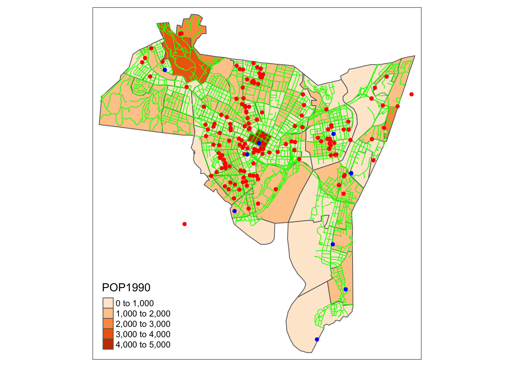
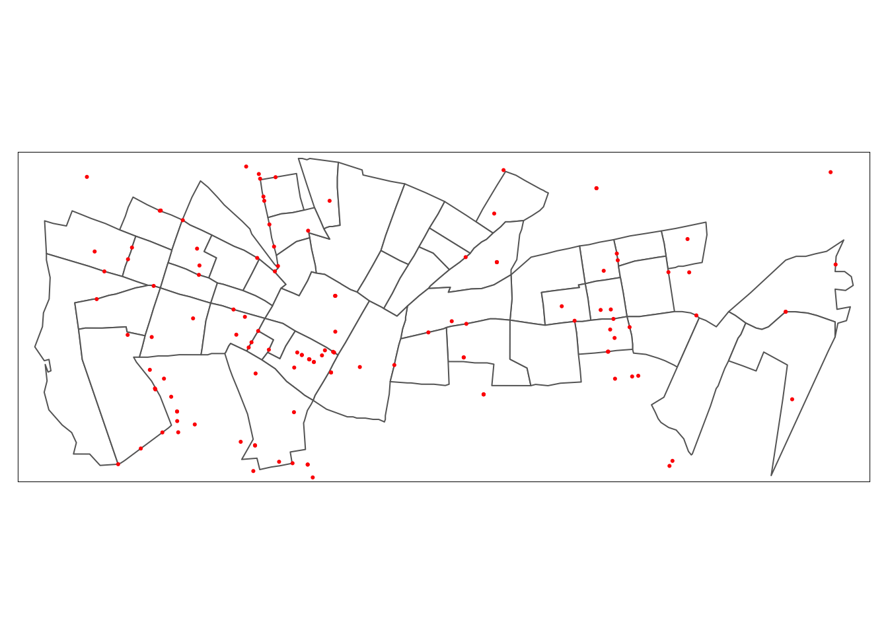
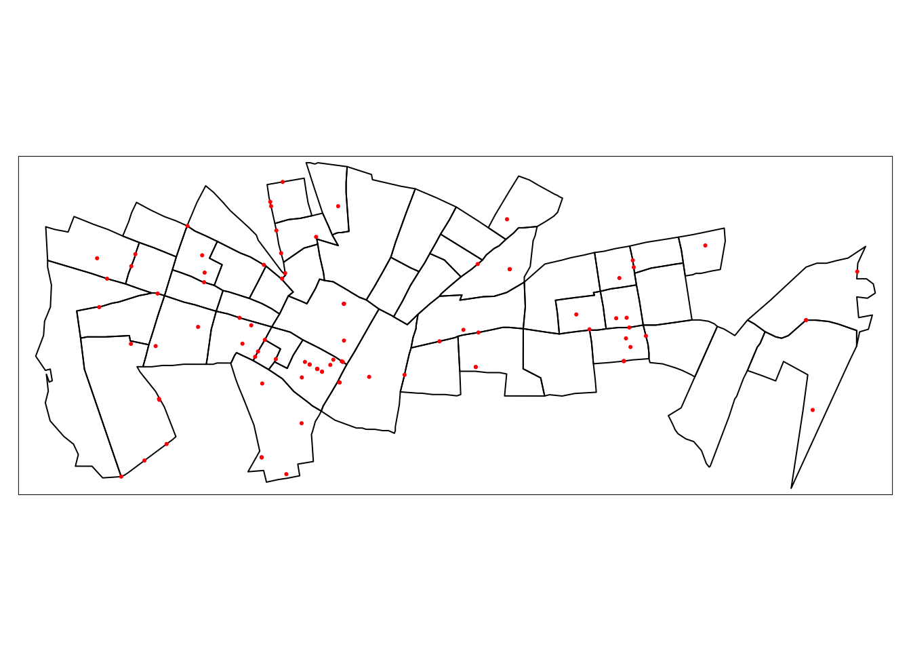
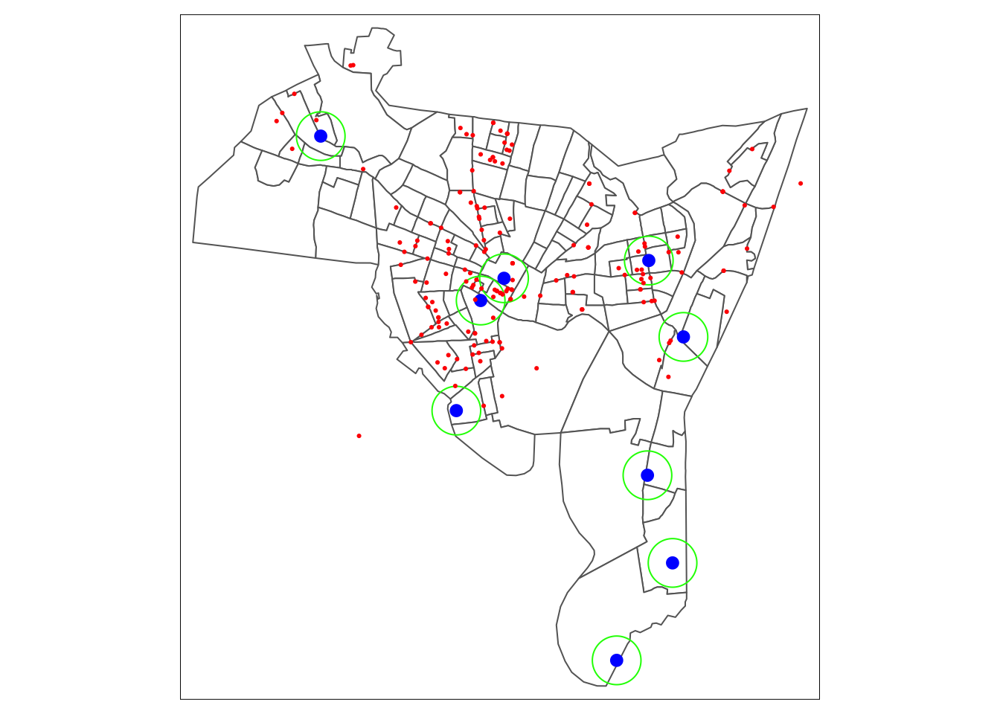
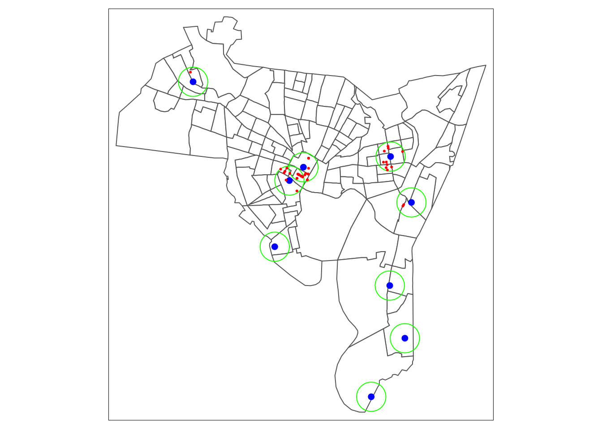
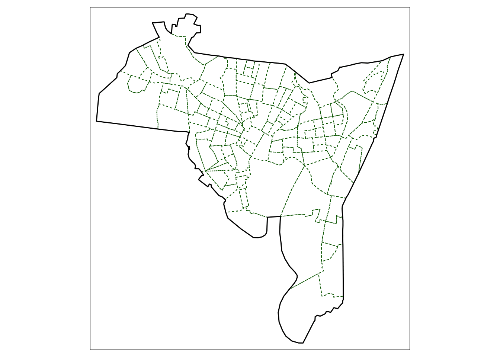
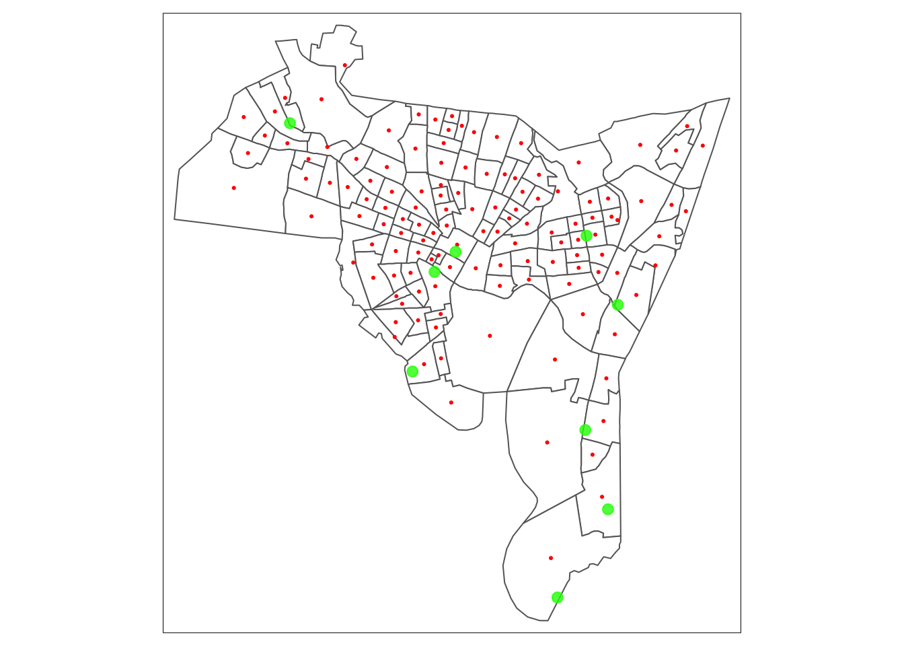
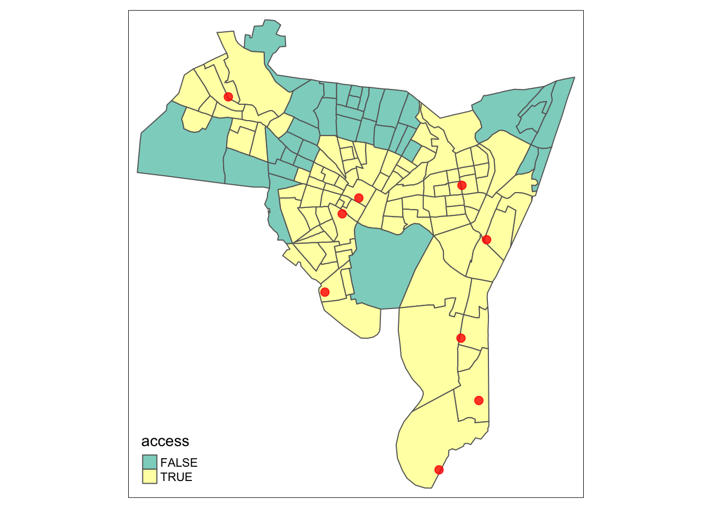

# Basic GIS Operations {#lecture4}

:::{.rmdtip data-latex="{tip}"}
**Thought box**
In GIS and spatial analysis, we are often interested in finding out how the information contained in one spatial dataset relates to that contained in another. 

+ Big Picture Question: Our public health goal is to investigate counts and/or rates of a given health indicator or event within the context of spatial attributes. 
+ What are some of the questions we may be interested in investigating?
    - Trends of rates/counts in specific locations or areas?
    - Relationship between outcomes and proximity to thinks in the physical environment.
    - Relationships between outcomes and socio-demographic risk factors. 
    - How many X are there in different locations of Y?
    - How many of X are found within a certain distance of Y?
    
+ Can you think of any public health or other research applications where we may want to answer the questions above? 
:::


In this chapter we will use examples to illustrate a number of fundamental and commonly applied spatial operations on spatial datasets. Essentially, the operations illustrate different methods for extracting information from one spatial dataset based on the spatial extent of another, referred to overlay operations. The sections below describe the following operations:
  
  1. Intersection and clipping one dataset to the extent of another, Section \@ref(sec1)
  2. Creating buffers around features \@ref(sec2)
  3. Merging the features in a spatial dataset \@ref(sec3)
  4. Point-in-polygon and area calculations
  5. Creating distance attributes
  6. Combining spatial data and attributes
  7. Converting between raster and vector
  
  
## New Haven Data

In lectures, we will illustrate analysis using data from the [New Haven CT crime web site] containing point sources of some crimes, plus roads, railways, and census block spatial data frames. The New Haven data include:
  
+ blocks: A polygon data set with demographic breakdowns by census blocks within New Haven.
+ breach: A point data set with locations of breaches of the peace.
+ roads: A lines data set with road spatial features in New Haven.
+ places: A point data set with locations of major landmarks in New Haven.
+ famdisp: A point data set with locations of family disputes. 

The plot below shows an example of the New Haven data, in which we plot population by census block (orange polygons), the breaches of peace (red), landmarks (blue), and roads (green.)



## Spatial  Clip and Intersection Operations {#sec1}

:::{.rmdnote data-latex="{note}"}
**What is clipping?**

A geographic clip cuts out an input layer to a defined spatial feature boundary. Like a cookie-cutter to a spatial area. The clip and intersect tool achieve the same results. The main difference is that an intersection preserves attributes from both tables.
:::


Consider the situation where the aim is to analyze the incidence of a particular area: we do not want to analyze ALL the data but only those records that describe events in a given study area. In the code below we call in the New Haven data and create $sf$ data frames for the blocks and breaches data. We then subset to areas in central New haven and subsets the census block data to only include these selected areas.


```r
#Call in the libraries
library(dplyr)
library(GISTools)
library(tmap)
library(sf)

#read in New Haven data and...
#transform the census block and breach data to sf objects
data(newhaven)
blocks_sf <- st_as_sf(blocks)
breach_sf <- st_as_sf(breach)


# Set the indices to subset
indices <- c(46:47,51, 53, 57:100)
# Create a new data set blocks_sf2 that includes only the selected areas
blocks_sf2 <- blocks_sf[indices,]

tm_shape(blocks_sf2) +
  tm_polygons(col = "white") +
  tm_shape(breach_sf) +
  tm_dots(col = "red")
```




Is this what we want? **No**. We want to clip the breach data to only include points within our selected areas. There are a number of ways to clip spatial data. The simplest way is to use the spatial boundaries of one as an index to subset another. 


```r
#Clip the breach data to align with the blocks2 data.

breach_clip_sf <- breach_sf[blocks_sf2,]
```


However, such clip (or crop) operations simply subset data based on spatial boundaries. There may be applications where you wish to combine attributes of different data sets based on *spatial intersection*. The $st\_intersection()$ function allows us to do this, shown below. Here we want to combine the breach and census block data from New Haven. You can see when we combine data sets we obtain a point data frame with census block attributes for each location. 


```r
#Intersect breach and block data
br_bl_sf <- st_intersection(blocks_sf2, breach_sf)
head(br_bl_sf)
```

```
Simple feature collection with 6 features and 28 fields
Geometry type: POINT
Dimension:     XY
Bounding box:  xmin: 546241.4 ymin: 169623.6 xmax: 558373.1 ymax: 177376.3
Projected CRS: SOURCECRS
   NEWH075H_ NEWH075H_I HSE_UNITS OCCUPIED VACANT  P_VACANT P_OWNEROCC
98       100         25       375      311     64 17.066667   4.266667
93        95        111         0        0      0  0.000000   0.000000
99       101         27       207      168     39 18.840580  11.111111
83        85        123       461      389     72 15.618221  29.067245
52        54         87       347      328     19  5.475504   2.305476
95        97         51       302      270     32 10.596026  36.092715
   P_RENTROCC NEWH075P_ NEWH075P_I POP1990  P_MALES P_FEMALES   P_WHITE
98   78.66667       100        528     499 56.91383  43.08617 73.547094
93    0.00000        95        523       0  0.00000   0.00000  0.000000
99   70.04831       101        531     782 53.45269  46.54731 30.306905
83   55.31453        85        511    1277 48.08144  51.91856 48.238058
52   92.21902        54        471     967 42.50259  57.49741  3.102378
95   53.31126        97        525     823 49.33171  50.66829 50.911300
    P_BLACK P_AMERI_ES P_ASIAN_PI   P_OTHER  P_UNDER5    P_5_13  P_14_17
98 14.82966   1.002004   9.018036  1.603206  0.801603  2.605210 0.400802
93  0.00000   0.000000   0.000000  0.000000  0.000000  0.000000 0.000000
99 45.26854   0.255754   0.511509 23.657289  9.335038 15.089514 5.626598
83 23.49256   0.156617   0.234926 27.877839 10.884886 17.306186 6.499608
52 94.20889   0.103413   0.000000  2.585315 14.788004 22.130300 7.032058
95 45.07898   0.243013   0.729040  3.037667  9.599028  8.626974 3.037667
    P_18_24  P_25_34   P_35_44  P_45_54  P_55_64   P_65_74   P_75_UP
98 37.47495 30.06012 12.825651 7.615230 4.208417  2.605210  1.402806
93  0.00000  0.00000  0.000000 0.000000 0.000000  0.000000  0.000000
99 10.99744 22.63427 18.414322 7.161125 4.219949  4.731458  1.790281
83 13.31245 17.85435 13.547377 9.162099 5.481597  3.054033  2.897416
52 14.06412 16.95967  8.273009 7.549121 4.446743  3.516029  1.240951
95 12.39368 15.30984 11.664642 7.168894 8.140948 10.692588 13.365735
                    geometry
98 POINT (551423.1 172304.5)
93 POINT (555168.5 172163.4)
99 POINT (549133.6 169623.6)
83 POINT (558373.1 173223.7)
52 POINT (549729.3 177376.3)
95 POINT (546241.4 171265.2)
```

```r
tm_shape(blocks_sf2) +
  tm_borders(col = "black") +
  tm_shape(br_bl_sf)+
  tm_dots(col = "red")
```




## Buffers and Features {#sec2}

:::{.rmdnote data-latex="{note}"}
**What is a Buffer?**

A buffer in GIS is a reclassification based on distance:  classification of within/without a given proximity.  In other words, a buffer in GIS is a defined zone or area created around a geographic feature such as a point, line, or polygon.

The buffer is typically measured in units of distance, such as feet, meters, or kilometers, and represents a specific radius or width around the feature.
:::


In many situations, we are interested in events or features that occur neat to our area of interest as well as those within it. We may be interested in crimes that occur within a certain distance of particular areas or locations. **Buffering** operations provide a convenient way of doing this, and buffers can be created using the $st\_buffer()$ function. In the New Haven data, there is a $places$ data frame that contains major landmarks in New Haven. We can create buffers around the major neighborhoods to define crimes that happen within a certain distance of the neighborhoods. 


Setting distance on the buffer: In case dist is a units object, it should be convertible to arc_degree if x has geographic coordinates, and to st_crs(x)$units otherwise.EMILY TO CHECK THIS I THINK BELOW IS 1500m. Pertaining to change projections. 


```r
data(newhaven)
breach_sf <- st_as_sf(breach)
places_sf <- st_as_sf(places, coords = c("longitude", "latitude"), crs = "NAD83")

st_crs(places_sf) <- st_crs(breach_sf)

#Create a polygon buffer around the places centroids. 
places_sf_buff <- st_buffer(places_sf, dist = 1500)


tm_shape(blocks_sf) +
  tm_polygons(col = "white") +
  tm_shape(places_sf) +
  tm_dots(col = "blue", size = 0.3) +
  tm_shape(places_sf_buff) +
  tm_borders(col = "green") +
  tm_shape(breach_sf) +
  tm_dots(col = "red")
```




Alternatively, if you want to subset data to only include those areas/points that are located within a certain distance of another spatial extent, we can use the$st\_is\_within\_distance()$ function. Below we want to identify the breaches that occur within 1500m of the neighborhood centroids. We use the above function to define the following: (1) The first input is the points we want to be the centroids, (2) The area/points that lay within a distance, and (3) The distance value. 


```r
indices_within_dist <- unlist(st_is_within_distance(places_sf, breach_sf, dist = 1500))
breach_within <- breach_sf[indices_within_dist,]

tm_shape(blocks_sf) +
  tm_polygons(col = "white") +
  tm_shape(places_sf) +
  tm_dots(col = "blue", size = 0.2) +
  tm_shape(places_sf_buff) +
  tm_borders(col = "green") +
  tm_shape(breach_within) +
  tm_dots(col = "red")
```




## Merging Spatial Features {#sec3}

In the intersection example, we selected census blocks within New Haven and used them to define the area of interest. Attributes for the selected census blocks were added to the point data for breaches. In other instances, we may wish to consider the area as a single object and merge all features within it. This can be done using the $st\_combine()$ function. As an exmaple, what is we wanted to derive the outline of the city of New Haven, we can merge all attributes from the census block data shown below. 


```r
merge_blocks <- st_union(blocks_sf)
merge_blocks
```

```
## Geometry set for 1 feature 
## Geometry type: POLYGON
## Dimension:     XY
## Bounding box:  xmin: 531731.9 ymin: 147854 xmax: 569625.3 ymax: 188464.6
## Projected CRS: SOURCECRS
```

```r
tm_shape(blocks_sf) +
  tm_borders(col = "darkgreen", lty = 3) +
  tm_shape(merge_blocks) +
  tm_borders(lwd = 1.5, col = "black")
```



The union operations merge spatial object sub-geometries. Once the merged objects have been created they can be used as inputs into the intersection and buffering procedures in order to select data for analysis. The merged objects can also be used in a cartographic context to provide a border to the study area being considered. 


## Point-In-Polygon and Area Calculations


### Point-In-Polygon
It is often useful to count the number of points falling within different ones in a polygon datasets. This can be done using the $poly.counts()$ function in the [*GISTools*](http://cran.nexr.com/web/packages/GISTools/GISTools.pdf) package, which extends on the $st\_contains()$ function. The code below assigns a list of counts of the number of crimes that occur inside each census block using the $st\_contain()$ function. We use the $lapply()$ function to count the number crimes in each list element. 


```r
crime.count <- rowSums(st_contains(blocks_sf,breach_sf, sparse = F))
blocks_sf$crime.count <- crime.count
blocks_sf$crime.count[1:10]
```

```
 [1] 2 0 2 0 2 0 0 0 3 0
```
These number represent the number of breaches in each census block in each row of the $blocks\_sf$ data frame. 

### Area Calculations

Another useful operation is to be able to calculate polygon areas. The $st\_area()$ function computes the euclidean or great circle distance between pairs of geometries. The results below show the square footage of the first 4 census blocks. Perhaps not a super useful metric to use. We can convert the calculation to square mile using the $ft2mile()$ function, which converts to 2.8 sq. feet per sq. mile. 

```r
areas_calc <- st_area(blocks_sf)
areas_calc[1:4]
ft2miles(areas_calc[1:4])
```


## Creating Distance Attributes
 
:::{.rmdnote data-latex="{note}"}
**Why is distance important?**

Distance is fundamental to spatial analysis. Distance measures are used to evaluate differences in accessibility for different social groups.
:::
 
We may wish to analyze the number of locations or people within certain distances of the spatial features.  Distance is approximated using a series of buffers created at specific distance intervals around features. The most common function used is *dist()*. This calculates Euclidean distance between points. 


Let's calculate the distance between the centroids (midpoints) of New Haven census blocks and the green spaces locations (these could also represent other features, i.e.,  facility locations, clinics). The locations of green spaces in NH is saved in the *places* dataset. 


```r
#Extract the centroids (midpoints) of the New Haven census blocks. 
centroids <- st_centroid(blocks_sf)

#Calculate the distance between the census block midpoints and the place locations.
#notes the use of the ft2miles function to convert to miles
cents_sf <- st_as_sf(centroids)
distances <- ft2miles(st_distance(cents_sf, places_sf))
distances[1:5]
```

```
Units: [US_survey_foot]
[1] 2.910784 2.666624 2.963935 2.924395 3.175274
```

```r
tm_shape(blocks_sf) +
  tm_polygons("white")+
  tm_borders("black") +
tm_shape(cents_sf) +
tm_dots("red") +
  tm_shape(places_sf) +
  tm_dots(col = "green", size = 0.3, alpha = 0.8) 
```


What do we get?

* distances: A 129 by 9 matrix. 
* For each block midpoint, the distance (in miles) to the 9 different places. 
* Using this matrix, we can provide a measure of the average distance experienced by people living in that area (census block) to get to those places. 


## Distance/Accessibility Analysis

The use of distance measures in conjunction with census data is particularly useful for analyzing access to locations or facilities. We may want to examines access to  green spaces or hospitals for different social groups. In our current example, we can examine the equity of access to local landmarks recorded in the *places* location data for different ethnic groups reported in the *blocks* dataset. We will use the census data to approximate the number of people with and without access of less than 1 mile.


```r
#Create a vector that calculates the minimum distance to green space for each census block
#Use the apply function that does row or column wise calculations, i.e., instead of doing every row separately. 
#?apply
min.dist <- as.vector(apply(distances, 1, min))
#Create indicator if there is a green space location within 1 mile (T or F)
blocks_sf$access <- min.dist < 1 #This statement says "is the min distance less than 1, yes or no?"
blocks_sf$access[1:3]
```

```
## [1] FALSE  TRUE  TRUE
```

Let's take a look at the data


```r
library(tmap)
# View(blocks_sf)

tm_shape(blocks_sf) +
tm_polygons("access") +
  tm_shape(places_sf) +
  tm_dots(col = "red", size = 0.3, alpha = 0.8)
```




The populations of each ethnic group in each census block can be extracted from the *blocks* dataset:

```r
# extract the ethnicity data from the blocks variable
head(data.frame(blocks[1:3,14:18]))
```

```
##     P_WHITE  P_BLACK P_AMERI_ES P_ASIAN_PI  P_OTHER
## 0  7.095159 87.02003   0.584307   0.041736 5.258765
## 1 87.105177 10.45262   0.195376   0.521003 1.725822
## 2 32.931727 66.26506   0.100402   0.200803 0.502008
```

```r
#Create a matrix of proportions of each ethnic group
ethnicity <- as.matrix(data.frame(blocks[,14:18])/100)[,1:5]

# Multiple proportion by the population to get the number within each group using colimn-wise apply() function.
ethnicity <- apply(ethnicity, 2, function(x)(x * blocks_sf$POP1990))


#Create a matrix of counts by group
ethnicity <- data.frame(matrix(as.integer(ethnicity), ncol = 5))
colnames(ethnicity) <- c("White", "Black",
"Native American", "Asian", "Other")

ethnicity$access <- blocks$access

head(ethnicity)
```

```
##   White Black Native American Asian Other
## 1   170  2084              13     0   126
## 2  2674   320               5    16    52
## 3   328   659               1     1     4
## 4   153  1142               6     6    26
## 5   672   223               3    12     3
## 6  1156    97               9    11    41
```


:::{.rmdtip data-latex="{tip}"}
**Lab 4 Activity**

1. Using your R Markdown file from Lab 3, read in your project data and convert it to an $sf$ data frame using the $st\_as\_sf()$ function as before. 

2. Using your area (polygon) data, create a set of indices to subset (you can set your own indices or you can use the code below which selects 5 indices at random out of 50 indices).

```r
indices <- sample(seq(1,50), size = 5, replace = F)
```

3. Create a data frame that only includes the selected row indices. 

4. Subset your point data to only include points in the selected areas.

5. Plot the subsetted point and area data using the $tmap$ functions. 

6. Using the full point and area data, create a buffer of 1000 m surrounding each point and create a plot with the boundaries of the spatial polygons, the points, and the surrounding buffers. 

7. Using the full point and area data, calculate the number of incidents that occur within each polygon using the $st\_contains()$ function. 

8. Using the full point and area data, calculate the number of incidents that occurred within a 1000 m distance of the point data. 

:::


