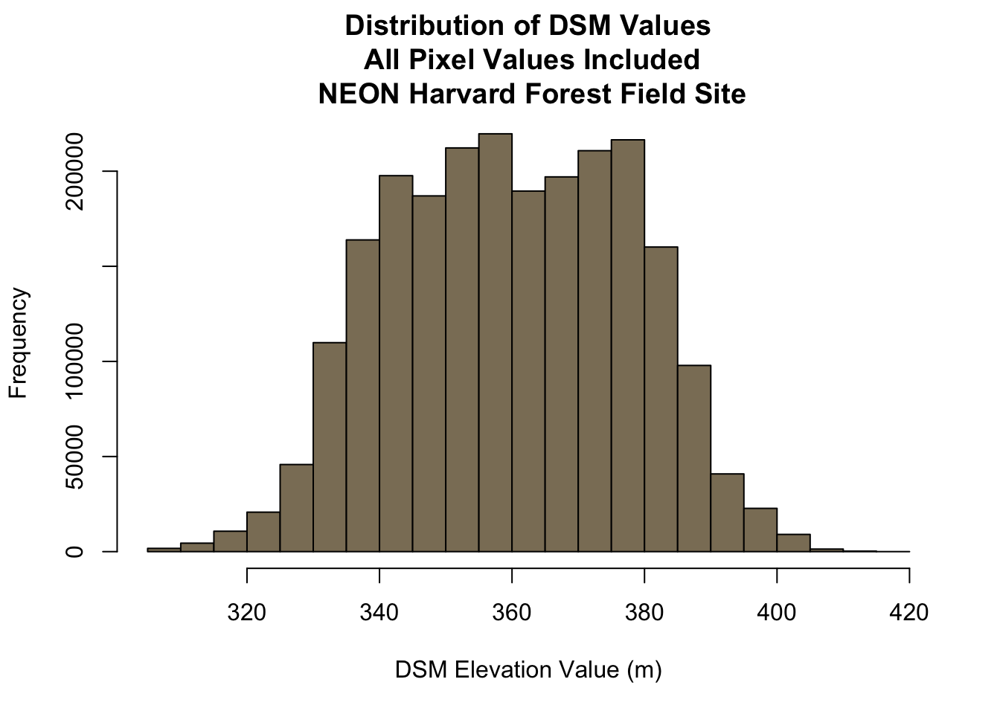

# Introduction to Raster in R

## What are we doing today:

In this tutorial, we will review the fundamental principles, packages and metadata/raster attributes that are needed to work with raster data in R. We discuss the three core metadata elements that we need to understand to work with rasters in R: **CRS**, **extent** and **resolution**. It also explores missing and bad data values as stored in a raster and how R handles these elements. Finally, it introduces the GeoTiff file format.

## Learning Objectives

-   Understand what a raster dataset is and its fundamental attributes.

-   Know how to explore raster attributes in R.

-   Be able to import rasters into R using the `raster` package.

-   Be able to quickly plot a raster file in R.

-   Understand the difference between single- and multi-band rasters.

## Things You'll Need To Complete This Tutorial

### Install R Packages

-   raster: install.packages("raster")
-   rgdal: install.packages("rgdal")

### Download Data

[NEON TEACHING DATA SUBSET: AIRBORNE REMOTE SENSING DATA](https://ndownloader.figshare.com/files/3701578)

The LiDAR and imagery data used to create this raster teaching data subset were collected over the National Ecological Observatory Network's Harvard Forest and San Joaquin Experimental Range field sites and processed at NEON headquarters. The entire dataset can be accessed by request from the NEON Data Portal.

## About Raster Data

Raster or "gridded" data are stored as a grid of values which are rendered on a map as pixels. Each pixel value represents an area on the Earth's surface.


## Raster Data in R

Let's first import a raster dataset into R and explore its metadata. To open rasters in R, we will use the `raster` and `rgdal` packages.


```r
# load libraries
library(raster)
library(rgdal)
```

## Open a Raster in R

We can use the `raster("path-to-raster-here")` function to open a raster in R.

**Data Tip:** OBJECT NAMES! To improve code readability, file and object names should be used that make it clear what is in the file. The data for this tutorial were collected over from Harvard Forest so we'll use a naming convention of \`datatype_HARV\`.


```r
# Load raster into R
DSM_HARV <- raster("images/HARV/DSM/HARV_dsmCrop.tif")

# View raster structure
DSM_HARV 
```


## Types of Data Stored in Raster Format

Raster data can be continuous or categorical. Continuous rasters can have a range of quantitative values. Some examples of continuous rasters include:

1.  Precipitation maps.

2.  Maps of tree height derived from LiDAR data.

3.  Elevation values for a region.

The raster we loaded and plotted earlier was a digital surface model, or a map of the elevation for Harvard Forest derived from the [NEON AOP LiDAR sensor](https://www.neonscience.org/data-collection/airborne-remote-sensing).

Elevation is represented as a continuous numeric variable in this map. The legend shows the continuous range of values in the data from around 320 to 400 meters.


```r
# render DSM for tutorial content background
DSM_HARV <- raster("images/HARV/DSM/HARV_dsmCrop.tif")

# code output here - DEM rendered on the screen
plot(DSM_HARV, main="Continuous Elevation Map\n NEON Harvard Forest Field Site")
```


Some rasters contain categorical data where each pixel represents a discrete class such as a landcover type (e.g., "forest" or "grassland") rather than a continuous value such as elevation or temperature. Some examples of classified maps include:

1.  Landcover/land-use maps.

2.  Tree height maps classified as short, medium, tall trees.

3.  Elevation maps classified as low, medium and high elevation.


Map of the United States showing landcover as categorical data. Each color is a different landcover category. Source: Multi-Resolution Land Characteristics Consortium, USGS


#### Categorical Elevation Map of the NEON Harvard Forest Site

The legend of this map shows the colors representing each discrete class.


```r
# Demonstration image for the tutorial
DSM_HARV <- raster("images/HARV/DSM/HARV_dsmCrop.tif")

# add a color map with 5 colors
col=terrain.colors(3)
# add breaks to the colormap (4 breaks = 3 segments)
brk <- c(250,350, 380,500)

# Expand right side of clipping rect to make room for the legend
par(xpd = FALSE,mar=c(5.1, 4.1, 4.1, 4.5))
# DEM with a custom legend
plot(DSM_HARV, 
	col=col, 
	breaks=brk, 
	main="Classified Elevation Map\nNEON Harvard Forest Field Site",
	legend = FALSE
	)

# turn xpd back on to force the legend to fit next to the plot.
par(xpd = TRUE)
# add a legend - but make it appear outside of the plot
legend( par()$usr[2], 4713700,
        legend = c("High Elevation", "Middle","Low Elevation"), 
        fill = rev(col))
```


## What is a GeoTIFF??

Raster data can come in many different formats. In this tutorial, we will use the geotiff format which has the extension `.tif`. A `.tif` file stores metadata or attributes about the file as embedded `tif tags`. For instance, your camera might store a tag that describes the make and model of the camera or the date the photo was taken when it saves a `.tif`. A GeoTIFF is a standard `.tif` image format with additional spatial (georeferencing) information embedded in the file as tags. These tags can include the following raster metadata:

1.  A Coordinate Reference System (`CRS`)

2.  Spatial Extent (`extent`)

3.  Values that represent missing data (`NoDataValue`)

4.  The `resolution` of the data

In this tutorial we will discuss all of these metadata tags.

## Coordinate Reference System

The Coordinate Reference System or `CRS` tells R where the raster is located in geographic space. It also tells R what method should be used to "flatten" or project the raster in geographic space.

Maps of the United States in different projections. Notice the differences in shape associated with each different projection. These differences are a direct result of the calculations used to "flatten" the data onto a 2-dimensional map. Source: M. Corey, opennews.org


## What Makes Spatial Data Line Up On A Map?

There are lots of great resources that describe coordinate reference systems and projections in greater detail (read more, below). For the purposes of this activity, what is important to understand is that data from the same location but saved in **different projections will not line up in any GIS or other program**. Thus, it's important when working with spatial data in a program like R to identify the coordinate reference system applied to the data and retain it throughout data processing and analysis.

## View Raster Coordinate Reference System (CRS) in R

We can view the `CRS` string associated with our R object using the`crs()` method. We can assign this string to an R object, too.


```r
DSM_HARV <- raster("images/HARV/DSM/HARV_dsmCrop.tif")

# view resolution units
crs(DSM_HARV)
```

```
Coordinate Reference System:
Deprecated Proj.4 representation:
 +proj=utm +zone=18 +datum=WGS84 +units=m +no_defs 
WKT2 2019 representation:
PROJCRS["WGS 84 / UTM zone 18N",
    BASEGEOGCRS["WGS 84",
        DATUM["World Geodetic System 1984",
            ELLIPSOID["WGS 84",6378137,298.257223563,
                LENGTHUNIT["metre",1]]],
        PRIMEM["Greenwich",0,
            ANGLEUNIT["degree",0.0174532925199433]],
        ID["EPSG",4326]],
    CONVERSION["UTM zone 18N",
        METHOD["Transverse Mercator",
            ID["EPSG",9807]],
        PARAMETER["Latitude of natural origin",0,
            ANGLEUNIT["degree",0.0174532925199433],
            ID["EPSG",8801]],
        PARAMETER["Longitude of natural origin",-75,
            ANGLEUNIT["degree",0.0174532925199433],
            ID["EPSG",8802]],
        PARAMETER["Scale factor at natural origin",0.9996,
            SCALEUNIT["unity",1],
            ID["EPSG",8805]],
        PARAMETER["False easting",500000,
            LENGTHUNIT["metre",1],
            ID["EPSG",8806]],
        PARAMETER["False northing",0,
            LENGTHUNIT["metre",1],
            ID["EPSG",8807]]],
    CS[Cartesian,2],
        AXIS["(E)",east,
            ORDER[1],
            LENGTHUNIT["metre",1]],
        AXIS["(N)",north,
            ORDER[2],
            LENGTHUNIT["metre",1]],
    USAGE[
        SCOPE["Engineering survey, topographic mapping."],
        AREA["Between 78°W and 72°W, northern hemisphere between equator and 84°N, onshore and offshore. Bahamas. Canada - Nunavut; Ontario; Quebec. Colombia. Cuba. Ecuador. Greenland. Haiti. Jamica. Panama. Turks and Caicos Islands. United States (USA). Venezuela."],
        BBOX[0,-78,84,-72]],
    ID["EPSG",32618]] 
```

```r
# assign crs to an object (class) to use for reprojection and other tasks
myCRS <- crs(DSM_HARV)
myCRS
```

```
Coordinate Reference System:
Deprecated Proj.4 representation:
 +proj=utm +zone=18 +datum=WGS84 +units=m +no_defs 
WKT2 2019 representation:
PROJCRS["WGS 84 / UTM zone 18N",
    BASEGEOGCRS["WGS 84",
        DATUM["World Geodetic System 1984",
            ELLIPSOID["WGS 84",6378137,298.257223563,
                LENGTHUNIT["metre",1]]],
        PRIMEM["Greenwich",0,
            ANGLEUNIT["degree",0.0174532925199433]],
        ID["EPSG",4326]],
    CONVERSION["UTM zone 18N",
        METHOD["Transverse Mercator",
            ID["EPSG",9807]],
        PARAMETER["Latitude of natural origin",0,
            ANGLEUNIT["degree",0.0174532925199433],
            ID["EPSG",8801]],
        PARAMETER["Longitude of natural origin",-75,
            ANGLEUNIT["degree",0.0174532925199433],
            ID["EPSG",8802]],
        PARAMETER["Scale factor at natural origin",0.9996,
            SCALEUNIT["unity",1],
            ID["EPSG",8805]],
        PARAMETER["False easting",500000,
            LENGTHUNIT["metre",1],
            ID["EPSG",8806]],
        PARAMETER["False northing",0,
            LENGTHUNIT["metre",1],
            ID["EPSG",8807]]],
    CS[Cartesian,2],
        AXIS["(E)",east,
            ORDER[1],
            LENGTHUNIT["metre",1]],
        AXIS["(N)",north,
            ORDER[2],
            LENGTHUNIT["metre",1]],
    USAGE[
        SCOPE["Engineering survey, topographic mapping."],
        AREA["Between 78°W and 72°W, northern hemisphere between equator and 84°N, onshore and offshore. Bahamas. Canada - Nunavut; Ontario; Quebec. Colombia. Cuba. Ecuador. Greenland. Haiti. Jamica. Panama. Turks and Caicos Islands. United States (USA). Venezuela."],
        BBOX[0,-78,84,-72]],
    ID["EPSG",32618]] 
```
The `CRS` of our `DSM_HARV` object tells us that our data are in the UTM projection.

<!-- The UTM zones across the continental United States. Source: Chrismurf, wikimedia.org -->
<!-- ```{r echo = F, fig.align='center', out.width='50%', message = F, comment = NA,warning = F} -->
<!-- knitr::opts_chunk$set(cache = TRUE, message =F, warning =F) -->
<!--  knitr::include_graphics("fig/Utm-zones-USA.svg.png") -->
<!-- ``` -->

The CRS in this case is in a `PROJ` format. This means that the projection information is strung together as a series of text elements, each of which begins with a `+` sign.

`+proj=utm +zone=18 +datum=WGS84 +units=m +no_defs +ellps=WGS84 +towgs84=0,0,0`

We'll focus on the first few components of the CRS in this tutorial.

-   `+proj=utm` The projection of the dataset. Our data are in Universal Transverse Mercator (UTM).

-   `+zone=18` The UTM projection divides up the world into zones, this element tells you which zone the data are in. Harvard Forest is in Zone 18.

-   `+datum=WGS84` The datum was used to define the center point of the projection. Our raster uses the `WGS84` datum.

-   `+units=m` This is the horizontal units that the data are in. Our units are meters.


## Extent

The spatial extent of an R spatial object represents the geographic "edge" or location that is the furthest north, south, east and west. In other words, `extent` represents the overall geographic coverage of the spatial object.


## Resolution

A raster has horizontal (x and y) resolution. This resolution represents the area on the ground that each pixel covers. The units for our data are in meters. Given our data resolution is 1 x 1, this means that each pixel represents a 1 x 1 meter area on the ground.


Source: National Ecological Observatory Network

The best way to view resolution units is to look at the coordinate reference system string `crs()`. Notice our data contains: `+units=m`.


```r
DSM_HARV <- raster("images/HARV/DSM/HARV_dsmCrop.tif")

crs(DSM_HARV)
```

```
Coordinate Reference System:
Deprecated Proj.4 representation:
 +proj=utm +zone=18 +datum=WGS84 +units=m +no_defs 
WKT2 2019 representation:
PROJCRS["WGS 84 / UTM zone 18N",
    BASEGEOGCRS["WGS 84",
        DATUM["World Geodetic System 1984",
            ELLIPSOID["WGS 84",6378137,298.257223563,
                LENGTHUNIT["metre",1]]],
        PRIMEM["Greenwich",0,
            ANGLEUNIT["degree",0.0174532925199433]],
        ID["EPSG",4326]],
    CONVERSION["UTM zone 18N",
        METHOD["Transverse Mercator",
            ID["EPSG",9807]],
        PARAMETER["Latitude of natural origin",0,
            ANGLEUNIT["degree",0.0174532925199433],
            ID["EPSG",8801]],
        PARAMETER["Longitude of natural origin",-75,
            ANGLEUNIT["degree",0.0174532925199433],
            ID["EPSG",8802]],
        PARAMETER["Scale factor at natural origin",0.9996,
            SCALEUNIT["unity",1],
            ID["EPSG",8805]],
        PARAMETER["False easting",500000,
            LENGTHUNIT["metre",1],
            ID["EPSG",8806]],
        PARAMETER["False northing",0,
            LENGTHUNIT["metre",1],
            ID["EPSG",8807]]],
    CS[Cartesian,2],
        AXIS["(E)",east,
            ORDER[1],
            LENGTHUNIT["metre",1]],
        AXIS["(N)",north,
            ORDER[2],
            LENGTHUNIT["metre",1]],
    USAGE[
        SCOPE["Engineering survey, topographic mapping."],
        AREA["Between 78°W and 72°W, northern hemisphere between equator and 84°N, onshore and offshore. Bahamas. Canada - Nunavut; Ontario; Quebec. Colombia. Cuba. Ecuador. Greenland. Haiti. Jamica. Panama. Turks and Caicos Islands. United States (USA). Venezuela."],
        BBOX[0,-78,84,-72]],
    ID["EPSG",32618]] 
```


## Calculate Raster Min and Max Values

It is useful to know the minimum or maximum values of a raster dataset. In this case, given we are working with elevation data, these values represent the min/max elevation range at our site.

Raster statistics are often calculated and embedded in a `geotiff` for us. However if they weren't already calculated, we can calculate them using the `setMinMax()` function.


```r
DSM_HARV <- raster("images/HARV/DSM/HARV_dsmCrop.tif")

# This is the code if min/max weren't calculated: 
# DSM_HARV <- setMinMax(DSM_HARV) 

# view the calculated min value
minValue(DSM_HARV)
```

```
[1] 305.07
```

```r
# view only max value
maxValue(DSM_HARV)
```

```
[1] 416.07
```

We can see that the elevation at our site ranges from 305.07m to 416.07m.

## NoData Values in Rasters

Raster data often has a `NoDataValue` associated with it. This is a value assigned to pixels where data are missing or no data were collected.

By default the shape of a raster is always square or rectangular. So if we have a dataset that has a shape that isn't square or rectangular, some pixels at the edge of the raster will have `NoDataValue`s. This often happens when the data were collected by an airplane which only flew over some part of a defined region.

In the image below, the pixels that are black have `NoDataValue`s. The camera did not collect data in these areas.


```r
# no data demonstration code - not being taught 
# Use stack function to read in all bands
RGB_stack <- stack("images/HARV/RGB_Imagery/HARV_RGB_Ortho.tif")

# Create an RGB image from the raster stack
par(col.axis="white",col.lab="white",tck=0)
plotRGB(RGB_stack, r = 1, g = 2, b = 3, 
        axes=TRUE, main="Raster With NoData Values\nRendered in Black")
```


In the next image, the black edges have been assigned `NoDataValue`. R doesn't render pixels that contain a specified `NoDataValue`. R assigns missing data with the `NoDataValue` as `NA`.


```r
# reassign cells with 0,0,0 to NA
# this is simply demonstration code - we will not teach this.
func <- function(x) {
  x[rowSums(x == 0) == 3, ] <- NA
  x}

RGB_stack <- stack("images/HARV/RGB_Imagery/HARV_RGB_Ortho.tif")

newRGBImage <- calc(RGB_stack, func)


par(col.axis="white",col.lab="white",tck=0)
# Create an RGB image from the raster stack
plotRGB(newRGBImage, r = 1, g = 2, b = 3,
        axes=TRUE, main="Raster With No Data Values\nNoDataValue= NA")
```


The assigned `NoDataValue` varies across disciplines; `-9999` is a common value used in both the remote sensing field and the atmospheric fields. It is also the standard used by the [National Ecological Observatory Network (NEON)](https://www.neonscience.org/).

If we are lucky, our GeoTIFF file has a tag that tells us what is the `NoDataValue`. If we are less lucky, we can find that information in the raster's metadata. If a `NoDataValue` was stored in the GeoTIFF tag, when R opens up the raster, it will assign each instance of the value to `NA`. Values of `NA` will be ignored by R as demonstrated above.

## Bad Data Values in Rasters

Bad data values are different from `NoDataValue`s. Bad data values are values that fall outside of the applicable range of a dataset.

Examples of Bad Data Values:

-   The normalized difference vegetation index (NDVI), which is a measure of greenness, has a valid range of -1 to 1. Any value outside of that range would be considered a "bad" or miscalculated value.

-   Reflectance data in an image will often range from 0-1 or 0-10,000 depending upon how the data are scaled. Thus a value greater than 1 or greater than 10,000 is likely caused by an error in either data collection or processing.


### Find Bad Data Values

Sometimes a raster's metadata will tell us the range of expected values for a raster. Values outside of this range are suspect and we need to consider than when we analyze the data. Sometimes, we need to use some common sense and scientific insight as we examine the data - just as we would for field data to identify questionable values.

## Create A Histogram of Raster Values

We can explore the distribution of values contained within our raster using the `hist()` function which produces a histogram. Histograms are often useful in identifying outliers and bad data values in our raster data.


```r
DSM_HARV <- raster("images/HARV/DSM/HARV_dsmCrop.tif")

# View the total number of pixels (cells) in is our raster 
ncell(DSM_HARV)
```

```
[1] 2319799
```

```r
# create histogram that includes with all pixel values in the raster
hist(DSM_HARV, 
     maxpixels=ncell(DSM_HARV),
     main="Distribution of DSM Values\n All Pixel Values Included\n NEON Harvard Forest Field Site",
     xlab="DSM Elevation Value (m)",
     ylab="Frequency",
     col="wheat4")
```




## Raster Bands

The Digital Surface Model object (DSM_HARV) that we've been working with is a single band raster. This means that there is only one dataset stored in the raster: surface elevation in meters for one time period.


A raster dataset can contain one or more bands. We can use the `raster()` function to import one single band from a single OR multi-band raster. We can view the number of bands in a raster using the `nlayers()` function.


```r
DSM_HARV <- raster("images/HARV/DSM/HARV_dsmCrop.tif")


# view number of bands
nlayers(DSM_HARV)
```

```
[1] 1
```

However, raster data can also be multi-band meaning that one raster file contains data for more than one variable or time period for each cell. By default the `raster()` function only imports the first band in a raster regardless of whether it has one or more bands.

## View Raster File Attributes

Remember that a `GeoTIFF` contains a set of embedded tags that contain metadata about the raster. So far, we've explored raster metadata **after** importing it in R. However, we can use the `GDALinfo("path-to-raster-here")` function to view raster metadata before we open a file in R.


```r
# view attributes before opening file
GDALinfo("images/HARV/DSM/HARV_dsmCrop.tif")
```

```
rows        1367 
columns     1697 
bands       1 
lower left origin.x        731453 
lower left origin.y        4712471 
res.x       1 
res.y       1 
ysign       -1 
oblique.x   0 
oblique.y   0 
driver      GTiff 
projection  +proj=utm +zone=18 +datum=WGS84 +units=m +no_defs 
file        images/HARV/DSM/HARV_dsmCrop.tif 
apparent band summary:
   GDType hasNoDataValue NoDataValue blockSize1 blockSize2
1 Float64           TRUE       -9999          1       1697
apparent band statistics:
    Bmin   Bmax    Bmean      Bsd
1 305.07 416.07 359.8531 17.83169
Metadata:
AREA_OR_POINT=Area 
```


Notice a few things in the output:

1.  A projection is described using a string in the `proj4` format : `+proj=utm +zone=18 +datum=WGS84 +units=m +no_defs`

2.  We can identify a `NoDataValue`: -9999

3.  We can tell how many `bands` the file contains: 1

4.  We can view the x and y `resolution` of the data: 1

5.  We can see the min and max values of the data: `Bmin` and `Bmax`.

It is ideal to use `GDALinfo` to explore your file **before** reading it into R.
